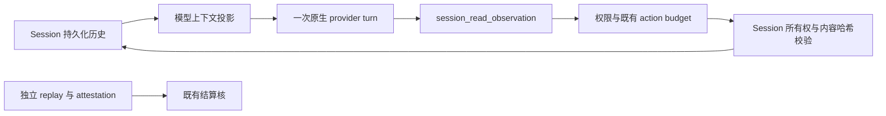

# ProContract × mini-swe-agent × SoL-Pi：三实例推导与验证

后续的[实际 ProgramBench 对照](pro-contract-observation-live.md)将此机制接入宿主开关，使用新模型轨迹验证。

2026-09-11。本轮交付一个默认关闭的原生 ObservationPack 候选，以及可以复现的九轨迹回放。
结论是：保持结算核稳定，优先改善观测的获得、保留和使用效率；本轮没有证明行为分数或实际费用改善。

工作树原本已有未提交的 observation、reference、replay 等改动。本轮在其上增加 Session 展示层压缩和回读，
不把这些已有改动或其他工作树的历史实验算作本轮贡献。没有启动新的模型推理，没有修改历史候选、评测结果或默认运行配置。

## 从实例判断问题

使用已有 `feedback-sol3-20260911-v2` 的三个 ProgramBench instance、三个执行臂，共九条完整轨迹。
冻结前确认 `sessionMessageCount` 与导出的消息数一致；九条共 754 个 assistant 消息，与各自记录的 provider turns 一致。
这些任务已经用于开发，不能作为未见过的确认集。

| Instance | 需要区分的能力 | 对本轮设计的约束 |
|---|---|---|
| `nikolassv__bartib.6b9b5ce` | 有状态 CLI、记录和命令行为 | 大量短探测的价值在输入选择；缩短旧长日志不能代替更好的探测 |
| `hush-shell__hush.560c33a` | 语言语法、运行语义、错误与外部命令 | 外层 shell 退出零不证明内部探测成功；诊断不应被轻率压缩 |
| `abishekvashok__cmatrix.5c082c6` | PTY、终端尺寸、按键和帧输出 | 重复发送终端长日志有明确成本，但字节、截断状态和回读必须可靠 |

先复核已有行为结果，而非以原生 `discharged` 代替兼容性。历史三臂结果来自
`/home/duozhou/run-artifacts/feedback-sol3-20260911-v2/REPORT.md`：

| 任务 | baseline | interface | empirical |
|---|---:|---:|---:|
| bartib | 36.20% | 96.26% | 86.69% |
| hush | 83.60% | 78.43% | 20.65% |
| cmatrix | 100.00% | 100.00% | 100.00% |

九条均为 `discharged`。这说明该批合约的交付认定与更广的行为兼容性确实是两个问题，
不说明原生认定违反了当时的有限 claim。每个单元只有一条轨迹，不能把分数差解释成稳定因果效应。
尤其不能因为 interface 的三题均值较高，就忽略 hush 回归。

工具轨迹进一步缩小了假设范围。interface 的 bartib、hush、cmatrix 分别有 216、117、22 次 `reference` 调用；
empirical 的 hush 有 120 次，分数却低得多。调用数量不能代替探测是否有效的检验。
这批历史运行使用其他工作树中的 `reference` 接口，不等同于当前工作树可选的 `reference_run` 实现。

在 cmatrix 中，大输出来自 `probe_cli.py`、`probe_modes.py`、`probe_frames.py` 和 PTY 按键探测。
baseline 还有一份 51,200 字节输出带 `truncated: true`，本轮始终不压缩它。
在 hush 中，消息 `msg_08eb39109001n0kq889twSycjs` 的 Bash 状态为 `{exit: 0, truncated: false}`，
但其 10,911 字节文本包含 118 行显式 error/panic 诊断，例如：

```text
Error: .probes/01_literals.hsh (line 9, column 10) - unexpected 'i'.
Panic in .probes/11_loops.hsh (line 7, column 9): value ([ 3, 4, 5 ]) has unexpected type, expected function
```

因此，“完整捕获、退出零、存在精确回读”仍不足以保证压缩后诊断具有同样的可见性。
这个真实反例导致了本轮第二版的保守准入规则。

## 吸收机制，而非照搬外壳

对照的源码版本为 [mini-swe-agent `2afd0fb8`](https://github.com/SWE-agent/mini-swe-agent/tree/2afd0fb81bacbf0aacfac9ded6f093c5acd0bf7c)
与 [SoL-Pi `74f6f97b`](https://github.com/NVlabs/SoL-Pi/tree/74f6f97b4577e8160dcfa7f26e44d32863b99c2c)。
这比旧 observation 文档引用的版本更新；本轮没有安装 Pi 或 SoL-Pi 插件。

| 来源 | 可吸收的精华 | ProContract 中的取舍 |
|---|---|---|
| mini 的 `DefaultAgent.step/execute_actions/save` | 查询、执行、观察的短循环；线性且可序列化的历史；环境接缝清晰 | 保留原生 Session runner，每轮一个显式 `llm.stream`；充分使用已有 Bash 的批处理能力；不要增加必填计划和复述制度的回合 |
| SoL-Pi Action Fusion | 把已知的修改后验证放进同一次交互 | 是可替换工具策略。单文件哈希不足以绑定整个候选、依赖和环境；若实施，必须分别保留修改与检查结果、逐项授权和计费，失败修改不得伪装成成功检查 |
| SoL-Pi ObservationPack | 旧大输出变成稳定入口，按需精确回读，原始历史不变 | 本轮实现；利用已有持久化 Session 文本，不再建立第二份归档和可变发送计数 |
| SoL-Pi Evidence-Preserving Reducer | 摘录必须匹配原日志；失败回退；额外推理可计量 | 引文真实不证明没有遗漏关键诊断。暂不增加模型摘要器，更不能让其输出承担 attestation |
| SoL-Pi Online Context Compact | 在经济收益和窗口压力允许时压缩已完成工作 | 必须结合缓存、回读、剩余预算和恢复行为衡量。现阶段不因 todo 完成自动增加 provider 调用，也不修改中断语义 |

mini 的完成哨兵是执行循环的终止机制，不是独立验收证据。SoL-Pi 的优化也没有提供 ProContract 的结算授权。
ProContract 应继续约束“什么可以使义务结束”，而把“怎样获得更多有效信息”留给可替换的执行层。

## 推导为原生实现

当前 Session 已持久化工具的原始展示文本。因此一次回读的坐标可以直接是
`(当前 Session, messageID, callID, block, SHA-256, offset, length)`。
不需要新数据库表、核状态、自动 attestation 或新的执行循环。



实现位于：

- `packages/core/src/session/observation-pack.ts`：纯投影、诊断否决与精确分页。
- `packages/core/src/tool/observation.ts`：宿主可选的原生回读工具。
- `packages/core/src/session/runner/llm.ts`：仅当回读工具在当前有效目录中可见时，使用投影；否则继续发送原内容。
- `packages/opencode/script/pro-contract-observation-study.ts`：读取冻结输入，调用同一生产实现，核对字节、身份和状态，输出逐轨迹结果。

准入条件为：原生 `read/glob/grep/bash` 的完成文本；不处理 provider 执行的工具、媒体、附件、已剪除的记录，
也不处理显式超时和截断。Bash 还要求已记录 `exit: 0`、`truncated: false`。
Contract、reference、回读工具本身均不在准入集合中。短的独立退出状态文本保持原样。

只有超过 10 KiB 且后面已有至少两个成功完成的 assistant 消息的文本块才可能替换。
这里计数的是持久化消息，不声称精确计算所有物理 HTTP 请求或 provider retry；多 assistant 输出的 provider 必须另行验证。
投影没有发送计数副作用，多次构造请求不会提前耗尽“首次完整展示”的窗口。

第二版额外否决带以下诊断词的 Bash 输出，大小阈值没有调整：

```text
\b(?:[a-z]*errors?|fail(?:ed|ure|ures|ing)?|fatal|panic|traceback)\b  (case-insensitive)
```

这是保守启发式：正常的 `0 errors` 或预期错误测试也可能被否决；没有匹配词也不能证明成功。
它只决定是否压缩文本，不赋予任何完成资格。首尾摘录标为 `utf8-lossy`，并明确指出省略部分可能包含失败。
不能把精确回读误称为保持了所有诊断的注意力显著性。

回读校验持久化消息所属 Session 和内容哈希，最多返回 16 KiB 字节。
UTF-8 页能精确往返且 JSON 转义不会膨胀时返回 UTF-8，否则返回 base64。
压缩策略收紧后，旧坐标仍可回读；更改可压缩性不会破坏此前已发出的入口。
原生 compaction 从模型历史中移除旧消息后，仍可通过 SessionStore 的直接消息读取取得文本。
这只验证已知坐标仍可读取；没有验证模型生成的 compaction 摘要一定保留所有回读坐标。
删除 Session、剪除或改变原文本会让回读失败，不伪造替代证据。

这里的“精确”仅针对已记录的工具展示文本，不会恢复之前在进程捕获或通用输出边界被丢弃的字节。
权威 replay 的原始字节继续由已有 ProContract observation archive 保存。
两种存储、两种 claim 不合并。

## 两版实际回放

先冻结九条输入及 SHA-256，再实施首版。核查 hush 后记录开发修订并实施第二版。
保留首版源码和结果，避免把本轮修订描述成预注册确认实验。
本轮全部数字都是对固定历史的重放；没有重新调用模型，没有产生新 ProgramBench 行为分数。

| 历史臂 | 任务 | 重建请求 | 第二版压缩块 | 首版消息字节减少 | 第二版消息字节减少 |
|---|---|---:|---:|---:|---:|
| baseline | cmatrix | 87 | 1 | 12.33% | 3.48% |
| baseline | hush | 105 | 0 | 1.96% | 0.00% |
| baseline | bartib | 33 | 0 | 0.00% | 0.00% |
| interface | cmatrix | 69 | 0 | 0.00% | 0.00% |
| interface | hush | 94 | 0 | 0.00% | 0.00% |
| interface | bartib | 105 | 0 | 0.00% | 0.00% |
| empirical | cmatrix | 52 | 6 | 30.56% | 30.56% |
| empirical | hush | 115 | 0 | 0.00% | 0.00% |
| empirical | bartib | 94 | 0 | 0.00% | 0.00% |

基线累计 canonical message JSON 为 270,649,785 字节；首版少 10,428,155 字节（3.85%）；
第二版少 7,193,460 字节（2.66%），保留了 hush 的整段诊断和 cmatrix 两段含诊断的探测记录。
第二版对七条轨迹完全没有消息字节收益。不能只展示最高的 30.56%。

第二版的七个替换块共 165,491 字节，按 997 字节分页进行 170 次精确回读核对，全部相同。
这个非整齐页长有意覆盖 UTF-8 跨页边界。所有原始历史、工具输入、状态和结构化结果均保持不变。
首版的十个替换块、213 页核对结果也单独保留。

这些字节数不包括工具目录新增开销、未来实际回读轮次、缓存失效、原生 compaction 和重试；
也不是 provider tokenizer 的 token 数或账单。尤其是这组轨迹有大量缓存读取，
省去已缓存文本的收益可能被改写前缀产生的缓存损失抵消。

应衡量的是 `省去重复上下文的费用 - 新增目录、回读和缓存改写的费用`，并同时要求交付和行为质量不回退。
固定历史重放无法检验模型在省略信息后会作出什么决定，因此本轮保留默认关闭，不晋升性能策略。

## 验证和复现

Core 的九个相关文件共 **172 tests passed，0 failed**；Core 与 OpenCode 均通过包内 `bun typecheck`。
覆盖原生 runner 的未安装、安装、权限隐藏三种路径；前两次完整反馈；持久化历史不变；
截断、失败、超时、媒体和证据回执保护；内部诊断否决；跨 Session 拒绝；哈希变更；
Unicode 和大量控制字符；compaction 后回读；action 额度耗尽。
实际回读沿原有注册表扣除 action，既不重置 turns/attempts，也不产生 handoff。

没有修改 public Protocol 或 Server HttpApi，因此本轮无需再生成 Client/SDK。

所有实验材料位于：

```text
/home/duozhou/run-artifacts/procontract-observation-pack-20260911-v1/
  protocol.json                 首版冻结协议与输入哈希
  protocol-guarded.json         检查诊断后的开发修订
  replay-initial.json           首版结果
  replay.json                   第二版完整逐请求结果
  initial/                     首版源码
  source-manifest.json          最终源码哈希
  core-tests.log
  core-typecheck.log
  opencode-typecheck.log
```

从 `packages/opencode` 重放：

```sh
bun script/pro-contract-observation-study.ts \
  /home/duozhou/run-artifacts/procontract-observation-pack-20260911-v1/protocol-guarded.json \
  /home/duozhou/run-artifacts/procontract-observation-pack-20260911-v1/replay.json
```

宿主启用方式是在其 Location node graph 中显式加入 `SessionObservationTools.node`。
没有把它加入默认工具图，也没有修改其他正在使用的 ProgramBench 工作树。
宿主必须保留此工具名的回读语义，不能用同名且行为不兼容的工具触发投影。

进一步的模型实验应固定同一模型、隔离环境、候选入口、总预算与参考访问，分别比较 packing、fusion 和组合；
记录首次观察后的实际回读、诊断漏用、缓存 token、完整交付、独立行为分数和端到端成本。
必须报告像 bartib 这样没有长日志的任务，并在未参与本轮选择的实例上确认。
本轮最明确的收益是建立了可测、可关闭、可回读的展示机制，以及用真实反例收紧其准入条件。
