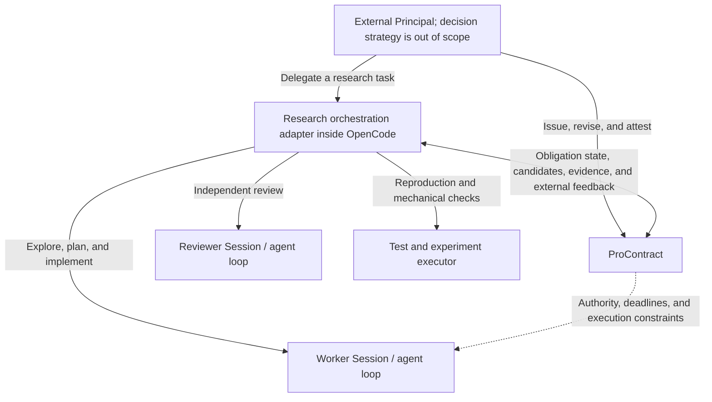

# An Independent Researcher with ProContract: Research Orchestration and Quality Control

2026-09-23 addendum: the explicit `python-script:1` verifier isolates Python and its descendants on Linux while retaining the original deadline and exact candidate/evidence identities. CPU PyTorch integration is exercised through the actual host entry with scripted providers and no real model calls. Advisory/required semantics and the failed SBNO trial remain unchanged; this establishes neither algorithm efficacy nor autonomous research success. See the [Python verification implementation record](pro-contract-researcher-python-verification.md). Earlier milestones below retain their original time-specific meaning.

> Current policy is maintained alongside the [Chinese master design and roadmap](pro-contract-researcher.md). The historical translation below originated from source SHA-256 `b3b9a4bb9eaf415bf059bf6a21befc224be5422f2c2ed96cfae1b25b12c6dfdb`. This edition preserves the source's structure, requirements, historical milestone records, and numbering, including the two subsections numbered 9.5. Statements about unfinished work within a milestone record describe the status at that milestone. Linked supporting designs and review reports remain in their original form.

Latest implementation status (2026-09-21): Default advisory v3 is implemented. The Researcher plans and executes; the host captures materials and requests independent review. Zero or partial responses, reasoned non-adoption and absent completion claims do not independently block authorized work or explicit submission. Trusted tool invocation metadata and immutable material views remain distinct. See the [focused design](pro-contract-researcher-default-flow.md), [implementation and acceptance record](pro-contract-researcher-default-implementation.md), and [independent code review](pro-contract-researcher-default-review.md). New four-dimensional measurement, archive export and per-instance sealing are wired to a dedicated `advisory-batch:1` launcher and tested through the same entrypoint using deterministic providers. See the [runner implementation](pro-contract-researcher-advisory-runner-implementation.md) and [independent review](pro-contract-researcher-advisory-runner-review.md). No real-model calibration, round eight, 66-case evaluation or historical derivative scoring was started.

Existing v2 implementation and milestones: Independent reviewer opinion, explicit Researcher response and host admission follow a versioned task policy. The [specialized design](pro-contract-researcher-feedback.md) passed [independent design review](pro-contract-researcher-feedback-design-review.md). Implementation and validation are recorded [separately](pro-contract-researcher-feedback-implementation.md), with an [independent code review](pro-contract-researcher-feedback-code-review.md). The v2 evaluation runner is documented separately in Section 0.1 and its [implementation record](pro-contract-researcher-runner-v2-implementation.md). Historical milestones retain their original semantics. The separately authorized fourth calibration and independent scoring of three cases are complete; see Section 0.2. The targeted follow-up and new feedback lifecycle are described in Section 0.3. Sections 0.4–0.5 record lifecycle wiring and an incomplete fifth calibration: two sealed candidate double-ratings, a third-case issuance failure, and no feedback ratings. The sixth three-case calibration and independent scoring/adjudication are complete; Section 0.7 records correct candidates and remaining feedback-lifecycle gaps. The 66-instance qualification evaluation remains unrun.

The latest result is in Section 0.9: round seven produced one independently double-rated correct candidate and two unsubmitted cases; a terminal-sealing defect blocked all feedback scoring. The calibration remains incomplete.

Design code baseline: `78bec1926`. Section 2 describes this baseline. S1 workspace changes and actual validation runs are recorded separately in Section 9.5. Historical experiment results and tests that have not been run are not treated as evidence that this design works.

## 0. Current Default for New Issuance: Host Binding and Optional Responses (v3)

This section defines the implemented default for new issuance and supersedes universal review/response formalities in historical designs. It does not reinterpret issued tasks. Validation and remaining integration boundaries are recorded separately. The [focused design](pro-contract-researcher-default-flow.md) contains source findings, transitions, compatibility and acceptance criteria. The [ProContract constitution](pro-contract-constitution.md) continues to govern authority and finality.

The Researcher owns planning, implementation, experiments and research choices within the original authorization. The host owns authenticated identity binding, material capture, independent review checkpoints, mechanical admission and candidate sealing. Reviewer findings, scientific judgments and severity P1 labels are advisory by default. The Principal remains external and owns direction, authorization and final recognition; implementing Principal research decisions remains outside scope.

The host binds revision, manifestHash, review identity and plan/candidate/evidence versions from authenticated execution and an immutable material view. Exact retries separately use tool-injected assistant message and tool-call IDs, never model-generated identity or content equality. The model supplies research content and selectable target objects rather than constructing long hashes. Execution identity alone is insufficient: stale views, concurrent changes and cross-job/candidate/version references still fail. Old requests never silently bind to the latest materials. Rejections preserve materialized state and remain auditable; ordinary protocol errors return the applicable schema, valid selectors and refresh instructions for correction within existing authority and deadline, without requiring Principal approval.

The new default permits reasoned non-adoption, retained disagreement and unanswered findings while continuing or submitting. A completed plan checkpoint automatically restores authorized execution. Candidate decisions use separate submit/continue actions; individual responses, repair intentions, completion claims and read acknowledgments are not admission requirements. Brief treatment explanations are encouraged; missing ones are recorded as `not_provided` or `unaddressed`. Ordinary suggestions need no repair lifecycle. The Researcher still maintains the plan when methods, data use or diagnostic retention change and verifies under the new version; old experiments cannot support a changed candidate.

The host requests reviews at fixed checkpoints, initially through bounded serial execution. Malformed output, timeout or startup failure retains its true unavailable state, raw material and reference resolution; it never becomes approval or an automatic retry-until-accept loop. Corrupt core evidence and unconfirmed cleanup separately block dependent actions. Permissions, scope, protected inputs, exact candidate/experiment/verification identity, concurrency, original deadline and immutable audit remain hard boundaries. Removing the entire old validator to remove response gates would violate this design.

Delivery retains all original opinions and their original targets, existing brief explanations, optional individual records, unresolved issues and missing-data markers. The host preserves actual code/plan changes and experimental observations; independent judgment determines whether a scientific repair is supported. Confirmed repair and absent completion can coexist; a fixed claim is not proof. Removing an optional diagnostic remains distinct from implementing correct selection/evaluation separation. `ready` still means an explicitly submitted candidate; only prescribed external exact recognition supports acceptance. Model silence or missing responses cannot become automatic submission or success.

Compatibility uses a new `reviewPolicy:{version:3,plan:"advisory",delivery:"advisory"}`. The first implementation supports only that new default combination. V1, all issued v2 tasks, explicit old protocols and v2 required/mixed modes retain their existing behavior; exact retries never backfill fields. Required phases continue through explicit v2 selection, retaining available accept and original response requirements. Unknown or conflicting versions fail. S1/S2 now select v3 for new default issuance; existing tasks are not migrated. The guarantee of independent approval before experiments/submission continues for historical v1 and explicitly required phases.

Future evaluation reports result correctness, feedback handling quality (including reviewer judgment), audit completeness and infrastructure status separately. A new reveal policy depends on each instance's sealed double ratings/adjudication or trustworthy no-candidate seal, without waiting indefinitely for another instance's failed seal. Candidate and feedback scoring contexts remain isolated; a context exposed to any feedback cannot later blind-rate an unsealed candidate. Missing evidence or unavailable scoring remains unscored for that instance, with the original denominator and no fabricated quality rating for an absent candidate. Round-seven rules and results remain frozen; any later reanalysis must have a separate derivative identity and exposure limitations.

The minimum implementation consists of S1 host identity binding and recoverable protocol errors; S2 independent advisory actions and complete delivery; S3 four-dimensional measurement and instance isolation. Acceptance cases A1–A16 in the focused design cover supported non-adoption, unanswered-opinion disclosure, actual repairs versus claims, protocol recovery, stale/unauthorized/changed/corrupt evidence, historical required semantics and isolation of another instance's scoring failure. Changes remain in the research host and research-eval; Core keeps generic authority, transaction and execution boundaries.

Original six-hour per-instance wall-clock deadlines, isolation, cancellation, bounded individual operations and accounting requirements remain unchanged, without new cumulative request, experiment or cost ceilings. Original ledger, supplemental facts and unknown usage stay separate. This design does not resolve the live accounting race or historical issuance stall. S3 now connects explicit v3 issuance, `advisory-development:1`, frozen rubrics and source/runtime checks, fresh stateless scoring contexts, cancellation/cleanup and per-instance reveal through a dedicated launcher. Confirmed local issuance failure or an unavailable rater does not block other complete instances; earlier startup failures remain conservatively shared/unknown. The Researcher now submits its own plan, and this adapter does not rerun the old independent diagnostic interventions: cross-round scores and detection strength are not equivalent. A future real batch still requires its own frozen model and scoring arrangements. This task runs deterministic integration only.

## 0.0 Implemented Review Policy and Responsibilities (v2, Preserved Semantics)

This section preserves the former default and the behavior of explicitly selected v2 tasks; Section 0 defines the new default. As confirmed by the user on 2026-09-20, reviewers provide independent opinions by default. The Researcher responds, and the research host admits actions under the immutable task policy. This section and the [v2 design](pro-contract-researcher-feedback.md) supersede the universal approval rules in the retained S1–S6 design below. Historical tasks, frozen configurations, reviews and results keep their original semantics. Existing review sign-offs do not cover future v3 implementation. Sections 0.1–0.9 and subsequent milestones retain their original point-in-time records. The first three development calibrations remain preserved; [round three](pro-contract-researcher-s6c-calibration-v3.md) retains both the malformed citation and the unsupported rejection. The policy implementation stage did not launch another calibration. The subsequently authorized fourth round is recorded in Section 0.2; qualification remains unrun.

The Principal defines the agreement and makes the final recognition decision. Implementing Principal research decisions remains outside scope. Reviewer findings include evidence, impact, suggested repairs and escalation. The Researcher must repair, rebut with grounds, or explicitly retain each unresolved issue. A severity P1 label is an opinion, not an automatically confirmed risk or a universal pause trigger; it is distinct from calibration case P1.

New issuance persists `manifest.reviewPolicy={version:2,plan:"advisory",delivery:"advisory"}` by default. Callers encode mandatory review with `required` for the applicable phase. The manifest and approved Spec bind this policy. Existing tasks with no policy and explicit `{version:1}` retain the legacy protocol; exact retries preserve the issued input. Only legacy tasks and explicit required phases retain the guarantee that independent approval is necessary before experiments or submission.

For v2, final review and the Researcher's response occur before the Core handoff. A feedback stage allows reads and control requests only. `review_response` binds the exact outcome and requires an answer to every finding. Ordinary repairs return to planning or execution within the original authority. Changed candidates lose their previous experiment and submission eligibility. Advisory continue/submit does not require accept; permissions, original deadline, hard constraints, plan/candidate identity, formal experiments, evidence integrity and complete responses remain mandatory. Required phases still need an available accept.

Execution admission, review opinion, candidate submission and external recognition are separate. `ready` means a reviewable candidate was submitted; it does not establish research correctness or reviewer approval. Only external exact attestation produces `accepted`. Core retains generic permission, identity, transaction and execution boundaries and gains no research decision semantics.

An unavailable reviewer has a separate `ReviewOutcome` with real availability, complete/partial/absent capture, original job status, raw message/output, immutable reference map, resolution and error. Advisory tasks receive this as feedback and may proceed within policy. The host never invents a valid review or automatically repeats reviews until accept. Unknown execution must first be stopped and audited. Corrupt candidate, experiment or archived evidence blocks dependent actions and cannot be downgraded to ordinary reviewer unavailability.

New reports select `{jobID,id}` references from the job's immutable map; the host resolves complete hashes. Unknown, ambiguous, cross-job, cross-candidate, cross-version and stale references fail. Historical malformed hashes are never repaired. Bundles retain all original opinions, responses, unresolved issues, severity and escalation across repair rounds. Submission recaptures the candidate after cleanup; exact recognition rechecks provenance and core evidence.

Evaluation separately records reviewer judgment, Researcher feedback handling and final candidate quality. Deterministic providers test infrastructure, not model judgment. Unrated feedback quality remains explicitly unscored. P1 regressions execute validation selection/test evaluation and test selection/same-test evaluation under wording variants, retaining original truth labels and false rejections. Per-instance six-hour wall-clock budgets, original deadlines, complete accounting and individual operation bounds remain unchanged, with no new cumulative request, experiment or cost limits.

See the [independent design review](pro-contract-researcher-feedback-design-review.md), [implementation record](pro-contract-researcher-feedback-implementation.md) and [independent code review](pro-contract-researcher-feedback-code-review.md) for the applicable version and validation scope. The earlier status and implementation milestones below are historical.

## 0.1 V2 Evaluation Runner and Development Scenarios

The [runner design](pro-contract-researcher-runner-v2.md) passed [independent design review](pro-contract-researcher-runner-v2-design-review.md). Deterministic integration checks and [independent code review](pro-contract-researcher-runner-v2-code-review.md) are complete; the [implementation record](pro-contract-researcher-runner-v2-implementation.md) states the validation scope. Explicit `evaluation:"feedback-v2"` selects three newly frozen `feedback-development:1` public task packets and measurement rules. Omission preserves the legacy v1 probes and scoring. V2 qualification issuance is rejected.

Original P1 probes continue to measure reviewer judgment. The new `followup` entry scripts only one initial good/bad plan and durably records its identity; subsequent feedback responses, implementation, formal experiments, evidence reads and submission come from the upstream worker. R3 starts with autonomous planning. The controller stops at first ready, actual termination, cancellation or the original deadline. It does not supply repairs or acceptance. The earliest created review job remains the first attempt even if incomplete; exposure requires actual transport evidence.

Candidate judgments are sealed before revealing reviews and feedback. Frozen P1 truth applies only to the matched seed plan; an autonomous R3 initial plan stays unscored for reviewer judgment. An instance without a submitted candidate can still receive ratings for observed reviews and feedback, while delivery quality remains indeterminate. Actual defects, unsupported objections and ordinary suggestions have distinct annotations. A repair of one finding and the overall correctness of the final candidate are separate dimensions.

Retained P1 diagnostics require executable selection/evaluation evidence. Isolated interventions vary validation and test data, observation names and array order. Removing the optional diagnostic is recorded as removal or relinquishment, never an implementation repair. Missing opportunities remain not_observed, and deterministic fixtures establish mechanisms only. The runner implementation stage did not launch a real fourth calibration or 66-instance evaluation; the separately authorized execution is recorded below. Original six-hour per-instance deadlines and complete accounting remain unchanged.

## 0.2 Fourth Real Development Calibration (2026-09-21)

The [fourth-round record](pro-contract-researcher-s6c-calibration-v4.md) preserves the pre-launch freeze, three real executions, independently sealed candidate judgments and feedback ratings. It uses the reviewed source, `feedback-development:1` and the previous `gpt-5.6-luna / low` configuration. Running source, configuration and scoring truth were unchanged. Both raters sealed all candidate judgments before receiving reviews or response trajectories; a third adjudicator resolved nine disagreements. Raters had separate contexts within the same model family, with cooperative material-access restrictions.

Both raters judged all three candidates correct, and all reached ready. Feedback handling remains a separate result. P1 bad actually implemented validation selection and test evaluation with verification, but prematurely claimed fixed and left its bound plan stale. P1 good received unsupported objections, removed the optional diagnostic without synchronizing its plan, and demonstrated no supported rebuttal. R3 read the evidence and correctly reported a negative effect of 1, but its named exports already existed and cannot count as a repair. The complete handling labels for all four findings are unresolved. Both P1 final reviews used hashes as selector IDs and remained unavailable, with honest continuation; R3 received a valid accept. Missing opportunities remain not_observed, with no extra runs to create them.

There were 63 real requests: 482,301 known ledger tokens and 487,696 tokens in complete transport captures. An interrupted operation accounts for the 5,395-token difference; its original unknown ledger entry is preserved alongside an exact transport reconciliation. Original six-hour deadlines, no cumulative count or cost ceilings, and historical artifacts remain intact. No external recognition or 66-instance evaluation occurred. Next work should address citation selectors, consistency between responses, plans and actions, and interrupted-operation accounting. Changed policy, continuation tasks and diagnostic evidence interfaces prevent matched historical comparisons; three correct candidates do not establish a model improvement or general research reliability.

## 0.3 Targeted Follow-up to Round Four (2026-09-21)

The [repair lifecycle, citation and supplemental usage design](pro-contract-researcher-repair-lifecycle.md) addresses the observed round-four gaps. The [implementation record](pro-contract-researcher-repair-lifecycle-implementation.md) and [independent code review](pro-contract-researcher-repair-lifecycle-code-review.md) retain the validation evidence. This work uses deterministic local fixtures and existing archives; it makes no fifth-round provider calls, launches no 66-case evaluation and changes no historical scores.

New v2 tasks freeze `feedbackProtocol:"repair-lifecycle:1"`. Initial responses use `repair_planned/rebutted/unresolved` and explicitly declare `planChange:retain|revise`. Changes to methods, data use or optional diagnostics require Researcher plan maintenance within the existing authorization, followed by execution and verification under the new version. Read-only delivery feedback can inspect retained evidence and append a `review_completion` bound to the original response/finding, current plan/candidate/verification and durable historical basis. Its `fixed/removed/rebutted/unresolved` disposition remains a Researcher claim for independent semantic judgment. Original claims, corrections, current applicability and pending intentions remain in delivery; unresolved issues do not become universal advisory gates.

Historical tasks with no protocol field retain response:1 semantics and exact issuance retries preserve field absence. The `feedback-development:1` runner explicitly retains response:1; evaluating the new lifecycle requires a separately frozen scenario. Explicit required phases and historical v1 still require available independent acceptance. New promptVersion:2 maps associate material labels with copyable selectors, while historical rendering and invalid raw reports remain unchanged.

The separate offline accounting entry writes provenance-bound supplemental facts and derived reports without changing Core state or the original ledger. Round-four R3 supports a 5,395-token supplement: original known 482,301 becomes derived known 487,696, while the operation remains interrupted and original usage remains unknown. Cost, external scoring usage and other unknown items are not filled with zero. Passing mechanical regressions does not establish reliable model feedback handling; a fifth development calibration remains a later decision, and the 66-case evaluation stays deferred.

## 0.4 Repair Lifecycle Evaluation Version

The fifth round explicitly selects `evaluation:"repair-lifecycle-v1"`, binding `repair-lifecycle-development:1`, `repair-lifecycle-measurement:1` and `repair-lifecycle:1`. The fourth-round entrypoint, scenarios and scoring remain unchanged. Actual-host fixtures connect original intentions, revised plans, formal experiments, completion claims and evidence to independent scoring. Historical provenance, current applicability and supersession are separate. Actual implementation repair, removal, rebuttal and pending intent remain visible even when the complete handling chain fails. Host-recorded claims do not establish scientific validity. Both independent judgments and necessary adjudication for all three candidates must be sealed before any feedback reveal; all reveal paths enforce that gate. See the [design](pro-contract-researcher-runner-lifecycle.md), [implementation](pro-contract-researcher-runner-lifecycle-implementation.md) and [independent code review](pro-contract-researcher-runner-lifecycle-code-review.md).

Real calibration requires a separate freeze of the inherited Luna / low configuration and scoring arrangement. Deterministic tests establish wiring only. Missing opportunities remain not_observed, without extra runs to manufacture them; the 66-instance evaluation stays deferred. Report the original ledger, independent supplemental facts and unknown items separately. The live usage-recording race remains unresolved, and derived known totals are not complete accounting. Protocol, prompt and measurement changes limit cross-round comparisons; differences cannot be attributed to model improvement. Historical v1 and explicit required-phase approval gates remain intact, while pending advisory intentions do not reinstate reviewer veto power.

## 0.5 Fifth Real Development Calibration: Incomplete Cohort

The [fifth-round record](pro-contract-researcher-s6c-calibration-v5.md) preserves the real freeze and execution after lifecycle wiring, 94 unique passing tests and independent review. The inherited Luna / low configuration and three-case denominator were fixed. P1 bad and R3 reached ready; both independent raters marked all six candidate criteria true and sealed their original judgments. P1 good timed out during `research-issue` preparation, with no real provider request or submitted candidate. The original failure and `cleanup.complete=false` remain intact. Later process checks found no research host, without retroactively certifying cleanup; the exact stalled sub-operation remains unknown.

The frozen rule requires all three candidate double-ratings to be sealed before feedback reveal. The missing third scoring package caused the actual reveal command to fail; all second-phase judgments remain `not_scored`, and raters received no feedback trajectories. P1 bad's final version-six plan and candidate both remove the optional diagnostic, with no completion claims. Removal does not demonstrate implementation of validation selection and test evaluation. R3 correctly reports signed effect +1 below the two-unit criterion; its raw reviews have no findings, so corresponding feedback opportunities are `not_observed`. Operator observations do not substitute for independent feedback ratings or establish lifecycle reliability.

The cohort made 81 real requests. Original known ledger usage is 674,632 tokens; a source-bound 6,207-token supplement for an interrupted R3 operation yields 680,839 known tokens. There are still 100 unknown operations, a missing operation snapshot for the failed instance, and unknown monetary cost and scorer-agent usage. The live race remains; derived totals are not complete accounting. Original six-hour deadlines and absence of cumulative ceilings remain unchanged. There were no extra runs, external recognition or 66-case evaluation. Next work should diagnose issuance/cleanup timeouts and separately version terminal-failure sealing for future cohorts. Changed protocol, visible instructions and measurement preclude attribution to model improvement. Source and historical integrity checks preceded these documentation updates; frozen artifacts remain unchanged.

## 0.6 Versioned Issuance Evidence and Terminal Sealing

The [post-round-five infrastructure design](pro-contract-researcher-infrastructure.md) limits changes to issuance/cleanup evidence and future no-candidate sealing. Explicit `infrastructure:{version:1,startup,operation,cleanup}` selects `candidate-or-terminal:1`: seal both independent judgments and required adjudication for every actual candidate, and seal failure or missing-state evidence for every remaining instance, before revealing any feedback. An absent field preserves the fifth-round three-candidate gate. This work neither rescores round five nor launches round six or the 66-case evaluation.

Issuance phase start/exit events, IPC wait expiry and actual process termination are separate facts. Wait expiry closes connection admission and requests bounded cleanup; late results remain archived without converting timeout into success. Confirmed cleanup requires supervisor reclamation plus evidence that the original host identity is gone or replaced. Otherwise state remains unknown. Only after confirmation are DB/WAL/SHM copied and the copy queried. The original instance deadline and the first cleanup deadline are not extended.

Terminal records bind the instance, original coordinates, runtime, policy, execution chain and evidence inventory. Known candidates, trusted late host responses and later evidence changes cannot silently become candidate absence. Arbitrary model JSON is not promoted to host state. Missing candidates retain the denominator without fabricated quality judgments; a normal not_submitted run can still have its observed feedback independently assessed with an explicit absence phaseOne. Mechanical sealing establishes neither research quality nor Principal recognition.

See the [implementation](pro-contract-researcher-infrastructure-implementation.md) and [independent review](pro-contract-researcher-infrastructure-review.md). Deterministic workflows establish wiring only. The exact fifth-round timeout cause and live usage-recording race remain unresolved. The two correct candidates, third infrastructure failure and unscored feedback remain historical results. Legacy v1 and explicitly required phases retain valid-review approval requirements; unresolved advisory opinions gain no automatic veto. Original six-hour deadlines, no cumulative request/experiment/cost caps, isolation and accounting requirements remain intact.

## 0.7 Sixth Real Calibration: Correct Candidates, Incomplete Feedback Lifecycles

The round retained Luna / low and the three repair-lifecycle-development:1 cases, explicitly freezing separate 30-second infrastructure startup, operation and cleanup limits plus candidate-or-terminal:1. The source matched the reviewed 6,617-file snapshot; 24 focused budget, gateway and wiring checks passed. Each case was issued once and cleanup was confirmed. Original six-hour deadlines and absence of cumulative count or cost caps were retained, with no extra runs. See the [calibration record](pro-contract-researcher-s6c-calibration-v6.md) and [independent scoring/audit record](pro-contract-researcher-s6c-calibration-v6-review.md).

Both independent raters passed all six candidate criteria for each case; every candidate judgment was sealed before feedback was revealed. Each rater then annotated 122 feedback items, with 21 disagreements independently adjudicated; 18 final item-level nulls remain. P1 bad actually implemented validation selection/test evaluation, synchronized its plan before execution and formally revalidated it. Missing completion claims do not erase that repair. P1 good legally removed the optional diagnostic while its current plan still required implementation, without an evidence-based rebuttal; its initial review contained both an unsupported objection and a valid implementation gap. R3 delivered a correct negative result; clarifying pairing language is not a new repair of the already-correct algorithm. All eight historical intentions remain pending_intent and no case appended a completion claim. Reliable feedback handling is not established.

All nine reviewer reports were available. Unavailable-review, issuance-timeout and no-candidate terminal opportunities were not observed; this cannot establish that the fifth-round root cause was fixed. Original known usage was 543,662 tokens, supplements 47,031 and derived known usage 590,693. The 116 unknown operation entries, unknown fees/scorer usage and live accounting race remain explicit. The incomplete fifth calibration and all historical results are preserved.

The next recommendation is a narrow design, regression and independent review of historical-intention closure, plan synchronization and finding-specific response presentation before deciding on another small calibration. Pending intentions, unresolved issues and severity P1 must not become universal vetoes; historical v1 and explicit required-phase approval semantics remain intact. Three cases under a changed runner/measurement do not establish general reliability or a controlled cross-round model improvement. The 66-instance evaluation remains deferred.

## 0.8 Closeout Guidance and Recoverable Journal Deduplication

The [targeted design](pro-contract-researcher-closure.md), [independent design review](pro-contract-researcher-closure-design-review.md), [implementation and regressions](pro-contract-researcher-closure-implementation.md), and [two independent code reviews](pro-contract-researcher-closure-code-review.md) are complete. No seventh-round or 66-case run was started. All 6,619 baseline files, symlinks and modes matched the sixth-round final snapshot; evidence is retained at `/workspace/researcher-closure-20260921T054035Z`.

The explicit `manifest.feedbackGuidance:"closure:1"` option requires v2 repair-lifecycle:1. Omission preserves historical prompts. Researcher first compares the plan with actual methods, data use and diagnostic retention, revising the plan and revalidating when they differ. Final-only tasks compare against the original agreement without requiring a plan. Delivery inspects historical intentions and real evidence, appends supported completion/correction claims or discloses pending work, and submits last. Complete historical opinions, response summaries, empty responses, original plans and claim applicability remain visible by `outcomeHash + findingID`. Identity applicability does not certify a repair. Advisory does not require every finding to become fixed; required phases and historical v1 retain their independent-accept gates.

The explicit `infrastructure.journal:"cas:1"` option stores recoverable content blocks while retaining each request/response identity, payload, error and late response. Restart preserves journal identity and sequence, with separate cleanup evidence for every connection. Earlier cleanup cannot authorize reading a later live host database. Archives validate the captured journal and its complete object closure; corrupt or missing references fail. Storage failure still performs bounded cleanup, and response persistence cannot extend an absolute deadline. Historical inline logs, polling and the history API remain unchanged.

The final runner/journal suite passed 48 tests and both package typechecks passed. SDK tests (29), the initial complete process suite (28), revised independent process checks (4) and the added empty-history case (1) are recorded separately. A deterministic sample used about 90% less storage with complete recovery; this is neither a diagnosis of round-five issuance failure nor evidence of reliable model behavior. Sixth-round repairs, plan inconsistencies and all 18 null scores remain sealed; most nulls reflect absent opportunities, not product defect counts. The issuance root cause and live usage race remain unresolved. Future reporting must separate the original ledger, sourced supplements and unknowns. A seventh small calibration requires its own explicit guidance/journal freeze and independent scoring arrangements, retaining original six-hour deadlines and no cumulative count or cost ceilings.

## 0.9 Seventh Real Calibration: One Double-Rated Candidate, Blocked Feedback Scoring

A separate freeze retained the three cases, Luna / low, original six-hour deadlines and independent double-rating/adjudication, explicitly enabling `closure:1` and `cas:1`. Each case ran once. See the [round-seven record](pro-contract-researcher-s6c-calibration-v7.md) and [independent scoring and engineering review](pro-contract-researcher-s6c-calibration-v7-review.md); artifacts are in `/workspace/researcher-calibration-v7-20260921T062428Z`. This round reran 28 targeted checks and passed post-run freeze verification without changing runtime code.

The good P1 case submitted a correct candidate: both independent raters marked all six criteria true. Its implementation retained validation selection/test evaluation and recorded four `fixed` completion claims, whose semantic support remains unscored. The bad P1 case revised its plan but failed to respond to the changed finding set. R3 twice omitted one character from its manifestHash in plan requests and stopped. Neither submitted a candidate. Terminal sealing incorrectly compared admission with a missing top-level agreement in these normally returned results. Independent engineering review confirmed the result-shape defect; the checked agreement and deadline coordinates match. Both terminal seals failed, so the frozen gate kept all feedback unrevealed and `not_scored`. This calibration remains incomplete; no bypass or extra runs were used.

All 10,361 CAS journal events were restored using archive objects only and matched the live restored streams. Complete restored JSON occupied 4,945,960,542 bytes versus 32,478,860 bytes for one journal-plus-block set, a 99.34% representation reduction; archive duplicates are counted separately. This is neither whole-directory compression nor evidence of lower latency. There were 51 real requests, 642,373 original known tokens, 9,202 independently sourced supplemental tokens and 651,575 derived known tokens. Seventy-five unresolved accounting entries, fees and scorer usage remain unknown. The live accounting race and fifth-round issuance root cause remain unresolved.

Next, repair and independently test sealing of normal no-candidate results, and diagnose worker identity copying, per-review finding sets and protocol-version error feedback before deciding on another calibration. Preserve this round's frozen failure. Three cases, changed prompts and different opportunities limit comparisons; four claim calls do not establish four genuine repairs. Historical artifacts remain unchanged and qualification remains unrun.

## 1. Goals and Design Decisions

An upstream Principal Agent supplies the research direction, scope, authority, deadline, and delivery requirements. The entire OpenCode instance acts externally as an independent Researcher, capable of exploring autonomously, developing plans, implementing code, running experiments, undergoing independent review, and fixing problems.

The product boundary of this project is the **Researcher**. The Principal is an external caller. This work does not implement its strategies for choosing research directions, composing tasks, allocating resources, or making final acceptance decisions. OpenCode receives authorized tasks, submits candidates and evidence, and handles external feedback; internal reviewers have review authority only. ProContract's principal authority and attestation APIs belong to the shared protocol boundary between the two parties. They do not constitute an implementation of a Principal Agent inside OpenCode.

Plan ownership confirmed by the user on 2026-09-19: The Principal defines the task agreement, including the research direction, goals, scope, hard constraints, authority, deadline, and delivery requirements. The Researcher autonomously refines and versions an execution plan within that agreement. The Principal may also explicitly prescribe a method, dataset, or complete plan; those prescriptions remain higher-level constraints that the Researcher must follow. S5 versions the Researcher's execution plan. Internal review and host admission can take effect only within the original authorization.

The goal is to detect, block, and trace common mistakes, and to recover interrupted work correctly. Research tasks may yield negative results. “The hypothesis was not supported” can be a valid delivery; experiments that were never run, missing evidence, and invalid comparisons must not be presented as successful research.

Design decisions:

- Add a research orchestration adapter at the host application layer to coordinate multiple existing V2 Sessions and mechanical verification jobs.
- Reuse the OpenCode agent loop for both the worker and reviewers, with separate contexts, working directories, and permissions.
- Keep ProContract responsible for obligations, authorization, candidate identity, final attestation, and challenges.
- Let the adapter interpret research stages, plan reviews, and experiment validity. Do not add research-specific kernel states or commands.
- Enforce conditions at trusted execution boundaries and attestation entry points. Prompts explain the work; they are not the sole enforcement mechanism.

S1–S5 and the S6b tools have completed their respective validation. S6c real-model evaluation and S6d real research pilots remain on the roadmap. This work does not launch real research experiments, modify frozen cohorts, or implement a Principal Agent, RSI, a general multi-agent platform, or cluster scheduling.

## 2. Existing Implementation and Gaps

| Existing implementation                                                 | Reusable capabilities                                                                     | Capabilities this design must not assume already exist                                         |
| ----------------------------------------------------------------------- | ----------------------------------------------------------------------------------------- | ---------------------------------------------------------------------------------------------- |
| [Kernel](../packages/core/src/pro-contract/kernel.ts)                   | Exact revision/spec/subject checks, separation of responsibilities, challenge propagation | Review of research methods; verification that evidence content is true                         |
| [Contract store](../packages/core/src/pro-contract.ts)                  | Transactions over state and the decision ledger; external attestation APIs                | Automatic reviewers; authentication of external report provenance                              |
| [Execution binding](../packages/core/src/pro-contract/open-code.ts)     | Durable Session/Prompt bindings, leases, cumulative accounting                            | Execution authorization and complete accounting for multiple reviewers under one research task |
| [Scheduler](../packages/core/src/pro-contract/scheduler.ts)             | Wakeup, recovery, and dispatch for native Contracts                                       | Plan gates, reviewer queues, recovery of research stages                                       |
| [Session runner](../packages/core/src/session/runner/llm.ts)            | One provider turn at a time, history reload, tool settlement, deadline interruption       | Judging whether methods are adequate for a research stage                                      |
| [Replay](../packages/core/src/pro-contract/replay.ts)                   | Rerunning bounded checks against frozen snapshots and retaining observations              | Automatically detecting zero tests, data leakage, inadequate coverage, or incorrect statistics |
| [Contract control tools](../packages/core/src/tool/contract-control.ts) | Requesting delivery, reporting blockage, requesting revisions                             | Consistent checks of the current Session/lease for every control call                          |

Two existing APIs must be distinguished:

1. `principalAttest` currently accepts only a Contract ID and `evidenceHash`. The service reads the current handoff to fill in candidate coordinates. It cannot express the exact subject the caller originally reviewed, leaving a change-after-read window that must be fixed.
2. `issueEvaluation` / `settleEvaluation` store external evaluations; `settleEvaluation` requires the delivery to have already been `discharged`. This is not a prerequisite review flow for the current delivery, and the scheduler does not start an external evaluator on its own.

Historical audits in the repository provide failure scenarios, but later implementations have superseded some descriptions. Implementation must follow this baseline code and new tests. In particular, do not carry forward obsolete descriptions of deadlines, environment forwarding, or Policy Contracts.

## 3. Layers and Authority



| Layer                                           | Responsibilities                                                                                                                                   | Outside its authority or required involvement                                       |
| ----------------------------------------------- | -------------------------------------------------------------------------------------------------------------------------------------------------- | ----------------------------------------------------------------------------------- |
| External Principal (the other party to the API) | Research direction, acceptance agreement, scope revisions, final attestation, and release; implementing its decision strategy is outside this work | Need not participate in every tool call or routine repair                           |
| Research orchestration adapter                  | Stage transitions, review jobs, evidence collection, recovery, validation of attestation materials                                                 | Cannot expand authority granted by the Principal or rewrite acceptance requirements |
| Worker Session                                  | Autonomously choosing exploration methods, submitting plans, implementation, experiments, interpreting results                                     | Cannot modify review records or attest to its own delivery                          |
| Reviewer Session                                | Reviewing a specified version, identifying defects that can be located, recommending verification                                                  | Cannot modify the candidate under review or invoke principal mutations              |
| Mechanical verifier                             | Executing frozen checks, collecting raw observations, producing structured results                                                                 | Cannot infer a complete research conclusion from an exit code alone                 |
| ProContract                                     | Persistence of obligations, authorization, exact identity, attestation, challenges, audit ledger                                                   | Does not interpret research plans or statistical methods                            |
| Agent loop                                      | Model calls, tool execution, event persistence, context, interruption                                                                              | Does not independently orchestrate a research organization                          |

The Principal may authorize the adapter in advance to schedule, return work for revision, and retry under predefined rules. Scope changes, changes to acceptance criteria, release, and final attestation must still originate from the external Principal. The first version does not implement an automatic attestation policy or give principal credentials to the research coordinator or reviewers. A reviewer's approval alone does not constitute discharge. The acceptance service may share a trusted host process with the Researcher, but identities, permissions, and call entry points must remain separate.

The minimum external interaction is to admit an approved task, read progress or a delivery bundle, provide feedback bound to the exact candidate, and explicitly revise, recover, or cancel. Implementation tests use deterministic callers to simulate these requests; no Principal Agent needs to be developed.

## 4. Lifecycle of a Research Task

### 4.1 Issuance and Bounded Exploration

The Principal approves the Contract and research manifest. The manifest defines the question, known conditions, deliverables, required checks, review rules, permitted exploration scope, and original absolute deadline. Its contents are immutable. Its hash is written into the approved Spec's brief as an explicit reference to the acceptance protocol and is bound by `specHash`. Changing the acceptance manifest requires a Contract revision, not merely a host configuration update.

Initial activity may include reading material, inspecting the repository, and conducting small probes explicitly permitted by the manifest. Until plan review passes, only the tools and resources for this stage are available. The host's tool and execution configuration decides admission to expensive experiments; it must not depend on the model labeling an arbitrary shell command “cheap.”

The first version should use stages whose restrictions can actually be enforced: the planning stage has read-only access to the candidate directory; any permitted probes use separate scratch space and host-configured execution entry points. Only the host can enable full implementation and experiment permissions.

### 4.2 Plan Submission and Independent Review

The Researcher's worker Session submits a versioned execution plan under the original task agreement. At minimum, it includes research subquestions and hypotheses within the task, a baseline, an implementation approach, experimental methods, controls and data splits, decision criteria for interpreting results, and known uncertainties. The plan must explicitly map to the original task requirements. Internal experiment criteria cannot replace or lower the acceptance criteria agreed with the Principal. If the Principal has supplied a detailed plan, the execution plan follows it and refines only the details delegated to the Researcher.

The reviewer receives the original delegation, constraints, plan, and necessary background, and assesses in a separate Session:

- Whether the plan follows the original task agreement, including methods, datasets, and acceptance requirements explicitly prescribed by the Principal.
- Whether the experiments can answer the proposed question, and whether comparisons are confounded by other factors.
- Whether baselines, controls, metrics, and failure conditions are complete.
- Whether there is obvious data leakage, incorrect statistics, an unreproducible dependency, or an infeasible resource assumption.
- Which defects must be fixed first, and which uncertainties may be disclosed while exploration continues.

The output is `accept`, `changes_requested`, or `unavailable`. Every blocking finding must point to plan content, a constraint, or evidence and explain how to resolve it. Invalid formatting, missing required inputs, and interrupted execution must never count as approval.

Approval is bound to the exact `planHash`, the original Contract revision/`specHash`, and the research manifest version. When research subquestions, evaluation protocols, data splits, or key methods change within scope, the Researcher updates the plan and obtains another review; the host readmits work under predefined rules. These changes within scope do not, by default, require individual Principal approval. The first version conservatively invalidates affected reviews rather than automatically inheriting approval through an unverified semantic diff. Detection of differences between the actual method and the plan distinguishes mechanically detectable input changes from methodological deviations requiring independent judgment, as described below.

Changing the research goal, hard constraints, acceptance requirements, authority, or deadline of the external delegation, or replacing a method or dataset prescribed by the Principal, requires a revision request through ProContract and a decision by the external Principal. Experiments requiring new authority must not run before that revision is approved. An internal reviewer's `accept` cannot substitute for the external decision. After the task revision changes, old plan reviews cannot simply carry over. If it is unclear whether a change remains within the authorized scope, retain the unresolved item and stop admission to the affected experiments. Neither the worker nor the reviewer may infer authorization on its own.

### 4.3 Implementation, Experiments, and Intermediate Checks

After plan approval, the worker proceeds autonomously within the approved scope. By default, it first reproduces the baseline and a minimal smoke test, then runs the main experiments.

The host verifier records commands, code versions, configuration, data identifiers, tests actually executed, failure and skip counts, raw output, and exit status. It cannot produce passing evidence if tests were expected but none ran, if the process succeeded but structured results contain failures, or if the origin of a result file is unknown.

Each task's verification adapter defines these criteria. Generic text searches cannot reliably interpret every test framework. Unparseable results remain `unavailable` or unknown facts and are handled under predefined rules; they are not treated as success by default.

Ordinary test failures are repaired within the current active execution, without creating a new Contract or automatically consuming a new semantic attempt. Method-change gates fall into two categories:

- **Mechanically checkable inputs.** The manifest specifies protected evaluation scripts, data splits, experiment configuration, and other inputs requiring prior approval. Formal experiments run through a host entry point that materializes frozen inputs for the job, checks approved hashes and the execution protocol, and protects those inputs during execution. Checking live files and then allowing a shell to modify them arbitrarily is insufficient. An input change closes admission to formal experiments. Changes to the original task agreement wait for external revision approval; changes to the Researcher's execution plan require renewed review and admission within the original authority.
- **Methodological deviations requiring judgment.** The worker's disclosures and an independent reviewer determine whether key algorithms have deviated from the plan or controls remain adequate. Deviations that cannot be detected automatically are a missed-detection risk to be measured. An unchanged `planHash` does not establish methodological compliance.

Profiles that offer a hard gate before experimentation must use a controlled execution entry point for formal experiments. An arbitrary shell must not simultaneously have permission to modify protected inputs and execute an approved formal experiment. If a cooperative profile still permits arbitrary shell access, results produced by bypassing the entry point are marked unadmitted and cannot support acceptance; the profile must explicitly refrain from claiming it prevented that computation from consuming resources. The first version does not build a general command-semantics classifier.

### 4.4 Freezing a Delivery and Final Review

The worker requests `contract_report_ready`. Research mode first validates the current plan approval and required execution records, persists the request, and closes admission to new mutating tools. The tool returns “delivery request received”; it must not wait inside the tool for its own drain to finish. After the tool returns, the coordinator waits for already admitted writes to finish or be interrupted and confirms cleanup of their child processes. It then captures the subject, runs replay, checks current authority, and submits the handoff, entering `verification`. If it cannot confirm that writes have stopped, it remains blocked and does not claim the candidate is frozen.

This short `freezing` stage belongs to the research adapter. The existing synchronous ready tool cannot serve this research path unchanged. It must submit a request through the appropriate driver, with the host completing the work outside the drain. Validation must cover concurrent write tools, delayed tool results, and cancellation during capture/replay. Even after new writes to the main workspace have been blocked, research permits cannot extend the original deadline.

The worker can no longer modify this candidate. Review always reads the retained subject, not a live workspace that may change. Reviewers and mechanical verifiers reproduce key checks in separate directories and verify the relationship between each conclusion and its raw evidence.

If builds or tests require writes, they may write to a disposable verification worktree created from the frozen subject. The frozen subject and the Researcher's workspace remain non-writable. Before cleanup, retain the verification artifacts, changes, and capture-completeness information required by the protocol, clearly distinguishing reviewed source from files generated during verification. Current replay cleans up its temporary directory; retaining evidence requires explicit additional integration.

Once acceptance materials are complete and pass review, they are submitted to the external Principal. The Researcher's usable milestone ends at a delivery bundle eligible for acceptance and the ability to repair it after external feedback. If a candidate defect is found, submit a defect report or challenge request bound to the exact subject; an authorized external party submits the challenge. The first version does not implicitly grant that authority to an internal reviewer or coordinator. If verification infrastructure is unavailable, retain a waiting or blocked state rather than fabricating candidate failure or success.

```text
Contract active:
  exploration -> plan_review -> execution
                    ^              |
                    +-- method change

contract_report_ready -> Contract verification:
  frozen candidate -> mechanical verification + independent review
    pass        -> publish reviewable bundle -> wait for external decision
    defect      -> publish defect report -> external challenge -> remediation
    unavailable -> waiting / owner-visible blockage

External Principal / shared ProContract boundary:
  exact attestation -> discharged
  exact challenge  -> dormant -> active remediation
```

A final negative result can receive attestation if the method is sound, the evidence complete, and the report accurate. `released`, deadline exhaustion, and interrupted research must be presented separately and must not count as successful research deliveries.

## 5. Independence and Trust Boundaries

An independent reviewer must meet at least these conditions:

- Use a different Session, reconstructing context from the original task and review materials rather than copying the worker's entire reasoning as the basis for review.
- Be able to read raw logs, code, plans, and failure records, rather than only successful summaries selected by the worker.
- Receive read-only access to the candidate and separate scratch space. Process tools must not thereby gain write access to the main workspace, ledger, or credentials.
- Have reviewer identity, model configuration, input materials, and output provenance recorded by the host. The worker cannot substitute a self-reported `passed` field for a reviewer.
- Recognize that separate Sessions using the same model provide separation of responsibilities, not proof of statistically independent errors. Different models or methods may support stronger review, but missed-detection rates still require measurement.

The trusted coordinator, research state store, and evidence archive reside outside worker-writable space. Principal credentials are held by the external caller or a separate trusted attestation entry point, and are not injected into the research coordinator, worker, or reviewers. The shared ProContract boundary applies the same evidence admission checks to every attestation entry point for research mode, including HTTP, CLI, and embedded paths. Protecting only a new UI is insufficient.

The first version may validate control logic in a cooperative local deployment. If workers can still access the host database, credentials, or review storage through a shell, results may only be reported under that threat model. Claims that the controls cannot be bypassed require actual boundary tests of process, filesystem, network, and credential isolation.

If the Principal needs to relax acceptance requirements, it must explicitly approve and record a new manifest or terms version. Review cannot be silently skipped while the result remains labeled as having passed a complete review.

## 6. Durable State and Exact Identity

The research adapter owns private state and event records. It does not add stage fields to `ProContract.Info.status`. The minimum logical objects are listed below. They may be implemented using a small number of tables and content-addressed files; a separate service for every object is not required.

| Object                                | Minimum records                                                                                                                                                                                              |
| ------------------------------------- | ------------------------------------------------------------------------------------------------------------------------------------------------------------------------------------------------------------ |
| Research manifest and approval record | Immutable question and delivery requirements, review/verification protocols, protected inputs, original deadline, and manifest hash; a separate approval record binds the root Contract ID/revision/specHash |
| Research state                        | Current manifest, stage, current planHash, candidate subject, pause/cancel flags, coordinator generation, review-validity version, associated jobs                                                           |
| Job                                   | Kind, exact input hash, Session/Prompt or process identity, input admission status, owner/generation, deadline, execution and accounting records                                                             |
| Review/verification report            | Job and input identities, reviewer/verifier identity, candidate/plan/protocol versions, verdict, raw evidence references, capture completeness                                                               |
| Acceptance context and bundle         | Unique round of the current handoff, manifest hash, planHash, review-validity version; applicable reports, evidence supporting conclusions, unresolved items, bundle hash                                    |

Principles:

- Hashes establish content identity. Trusted provenance comes from jobs actually started by the host and a protected chain of records.
- Plan changes invalidate old plan approvals. Candidate changes invalidate code/result reviews that depend on that candidate. Historical records are retained.
- `requires` continues to express genuine support dependencies only. It does not represent stage ordering or reviewer invocation relationships.
- Literature, data, environments, and external services are not necessarily covered by a Git tree. The research manifest and verification reports must record actual dependencies and disclose anything that cannot be frozen.
- The research manifest is the approved acceptance agreement. It does not restore the deleted `Spec.policy`, `Requirement.policy`, or global `contract_policy`.

The manifest body does not include the resulting `specHash`, avoiding a cycle in which the Spec contains the manifest hash and the manifest contains the Spec hash. A separate approval record links the two.

The coordinator generation is used only to fence execution ownership. The review-validity version invalidates approvals. Each new handoff's unique identity distinguishes separate delivery rounds for the same subject. These three identities are not interchangeable. A challenge revokes the current acceptance context; resubmitting identical source still requires a new handoff identity.

S1's `Binding.generation` identifies each execution claim and increases on every claim. It is distinct from the future research coordinator's generation. Historical bindings without this field are interpreted as generation 0; the next claim advances it to 1. A call lacking trusted tool-call identity is still rejected. Compatibility defaults cannot retroactively authorize an old call.

## 7. Integration with Existing Scheduling and the Agent Loop

### 7.1 One Scheduling Owner per Binding

Do not add another loop that calls `claim`/`prompt` alongside the current scheduler. The two would compete over the same execution during plan review, recovery, and heartbeats.

The proposal is to add a host-set scheduler identifier, such as `driver`, to the OpenCode execution binding, with a default that preserves native scheduling. This is execution-adapter metadata, not part of the Contract Spec or kernel state.

- The driver's responsibility covers activation, claim, heartbeat, drain outcomes, blocked/retry handling, and recovery. A native driver handles only its own bindings. Shared deadline checks still apply, but another driver must not renew the lease or reschedule the work.
- The research coordinator owns stage admission and these execution decisions for research bindings, reusing existing Session admission and drain mechanisms.
- If the research driver is unregistered, the manifest is missing, or recovery is impossible, the binding must not fall back to ordinary execution.
- Issuing a research task must make the duty, the binding's driver, and its initially closed stage admission visible consistently. An explicit transactional entry point may be used. Do not first issue a runnable ordinary Contract and asynchronously attach a research label.
- Coordinator scheduling authority is separate from Session drain ownership. Do not introduce a durable drain identity around provider turns.

The `driver` migration, native defaults, and atomic issuance are integration prerequisites; the current API does not yet provide the complete capability.

In particular, `session/execution/local.ts` must change: normal drain completion currently calls `reschedule(new)` directly, and terminal provider errors escalate directly. Instead, deliver a generic completion outcome carrying the current Session, Prompt, owner, and generation to the binding's driver. The research driver uses persisted stage intent to distinguish normal waiting from actual failure. Stale completion callbacks must not change a new owner's state.

After plan submission, stop new execution and confirm that the current drain and tools have finished before releasing the execution lease and recording the waiting stage, preserving the same semantic attempt. After review, the research driver admits a new prompt and claims execution again. A normal pause must not reach native `reschedule(new)`. Retry decisions for `contract_report_blocked` also belong to the relevant driver; “plan complete, waiting for reviewer” must not be disguised as blocked work. None of these waits or stage transitions resets cumulative usage or the deadline.

### 7.2 Stage Admission Requires Actual Execution Boundaries

The research adapter computes the capabilities and deadline allowed for the current Session. Core performs generic authorization and revocation checks at provider admission, tool execution, and control-tool entry points. Core consumes a bounded execution permit without interpreting research vocabulary such as `plan_review`.

The worker's permit must intersect with existing permissions, the active Contract lease, revision, and deadline; it cannot override or expand them. Reviewers use the separate verification-job permits described next and do not need the worker's lease on an inactive root. Entering review-waiting, pause, or cancellation revokes affected execution permits and interrupts existing work. Calls awaiting execution must be rechecked so an old provider response cannot continue producing effects after a stage change.

Do not add a second tool representation or authorization callback to `ToolRegistry`. Preserve the architecture in which leaves own permissions and side-effect ordering. Provider admission and each actual execution entry point read a generic permit service and revalidate after permission responses that may involve waiting. This includes control tools, child actions of composite tools, and verification processes. Tool catalog filtering determines visibility only; it is not execution authorization. This boundary must pass real bypass tests before the research profile is enabled.

Preserve these Session constraints:

- `SessionExecution` remains process-global and Session-ID based; runners, tools, and context services remain Location-scoped.
- `SessionV2.prompt` performs durable admission before advisory wake; exact retries reuse the same prompt ID and delivery mode.
- Each provider turn retains one explicit `llm.stream(request)` call. Do not embed another agent loop inside a tool.
- Stage transitions use safe boundaries, explicit interruption, and admission of new work. Appending a steer alone does not establish that old tools have stopped.

### 7.3 Reviewer Jobs Must Not Impersonate the Main Execution Binding

The current binding associates one Contract with one current execution Session. Reviewers must not be rotated into that field or borrow an expired worker lease.

The research adapter separately persists reviewer jobs and executes them through native Session APIs. Before startup, it binds host-owned read-only permissions, the original deadline, cancellation flags, and accounting attribution. Sessions need a durable controlled-job identity. After restart, if the job, driver, or permit has not been loaded, prompt/resume must be rejected rather than falling back to an ordinary unbound Session. An ordinary Session without this integration cannot be used to claim that research review is constrained.

In particular, when the root Contract is in `verification`, the main worker may not continue execution. The reviewer's permit comes from a separate host verification job and allows only inspection of the frozen candidate. It does not obtain execution authority by pretending the root is `active`.

### 7.4 Attestation Entry Points Bind to the Candidate Expected by the Caller

This section is a **shared ProContract boundary fix**. It ensures exactness of calls made by the external Principal. It does not implement research decision strategies such as who should pass or when to accept a negative result. The Researcher produces the necessary identities and evidence; an authorized external caller submits the attestation.

Extend attestation inputs to require the caller's expected `revision`, `specHash`, `subjectHash`, the current handoff's unique identity, the acceptance-context hash, and an attestation operation ID. The first three coordinates alone are insufficient: if the same subject is challenged and then delivered again, an old request may still match all three.

Trusted storage assigns each handoff a non-reusable identity, represented by a new ID or the exact identity of an accepted handoff event. Millisecond timestamps and subjectHash cannot substitute for a delivery round. Migration of historical handoffs must establish a mapping from a unique historical event; if identity cannot be determined uniquely, reject rather than guess. This is a generic delivery identity, not a research-specific state.

The research profile first validates immutable report bytes and host-job provenance. It then compares current root coordinates, handoff identity, immutable acceptance context, review-validity version, and current admission status within **one authoritative commit transaction**, performs discharge, and records an operation receipt. Host validation and ordinary discharge cannot be two separate commits with a gap between them.

The minimum profile/context references and operation receipts participating in the attestation CAS must therefore live in the same transaction domain as the Contract store. Large reports and research orchestration details remain host-owned. Core compares opaque identities and versions without interpreting research methods. This requires a composable transactional storage entry point; do not assume that the current `principalAttest` already supports it. Manifest changes advance the root revision; revocation of relevant approvals advances the review-validity version; challenges and new handoffs change the delivery round and revoke the old context.

A retry with the same attestation operation ID returns only the historical receipt saved for that operation, with a separate indication of whether its support remains valid now. Reusing an ID with different content must conflict. If a challenge occurred afterward, retrying the old operation cannot discharge again. The current behavior of generating a new attestation ID for every call must change.

Review requirements cannot rely on an optional frontend check. Implementation must enumerate every reachable principal mutation path and ensure that research attestations pass through the same host validation. Direct Core service access remains a trusted internal capability and must not be exposed to workers.

A durable research-profile marker makes a Server or CLI without the research validator reject attestation for that task. A missing adapter cannot trigger fallback to an ordinary entry point that accepts only `evidenceHash`. Generic interfaces and transactional projections live in Core; the host supplies research validation. Server and Core must not import `sdk-next` in the reverse dependency direction.

Control tools independently check the current Session/owner/lease/revision. Exemption of certain control operations from action counting does not exempt them from execution authorization. After replay for `report_ready` finishes, authority to commit must still be checked.

## 8. Recovery, Cancellation, and Budgets

### 8.1 Recovery Protocol

Persist job identity and exact inputs before admitting a Session prompt. On restart, the coordinator recovers from jobs, the Session inbox, original events, and reports. Session existence alone does not imply that work started or finished.

| Interruption point                   | Recovery requirement                                                                                                                                                               |
| ------------------------------------ | ---------------------------------------------------------------------------------------------------------------------------------------------------------------------------------- |
| Job created, prompt not admitted     | Complete admission using the same job/Session/Prompt identities                                                                                                                    |
| Prompt admitted, wake not issued     | Reissue advisory wake without duplicating the user message                                                                                                                         |
| Prompt promoted, completion unknown  | Inspect provider/tool events; explicitly choose whether to continue the same work or create a new attempt that preserves lineage. Reissuing wake alone does not establish recovery |
| Provider/tool execution interrupted  | Retain known usage and unknown values; assess side effects first and do not blindly replay mutations                                                                               |
| Report written, stage not advanced   | Validate the existing report and advance idempotently without starting the same successful job again                                                                               |
| Attestation committed, response lost | Check the current exact attestation and operation identity; return the same result or an explicit conflict                                                                         |
| Coordinator lease taken over         | The old generation cannot advance stages, commit reviews, or publish the current acceptance context; external attestation must still compare against the current context           |

This is an explicit recovery protocol for research jobs. It does not authorize generic Sessions to retry all provider work automatically after a process restart. The first version uses a single host and serial stage scheduling. The worker and the final reviewer of the same candidate do not concurrently write shared directories.

Idempotency records do not guarantee exactly-once execution of arbitrary shell side effects. If the outcome of a mutation is unknown, inspect actual artifacts or escalate to the owner first. Read-only reviewer checks may be rerun under recorded recovery rules, preserving every attempt and its cost.

### 8.2 Cancellation and Failure Handling

When the user stops research, persist the cancellation flag before interrupting associated Sessions and child processes. Restarting the coordinator must not automatically resume canceled work. Cancellation is not discharge; the obligation remains visible for the external Principal to resume, revise, or release. Cancellation invalidates any attestation context whose operation has not yet committed. The Principal may later explicitly inspect retained materials, establish a new valid context through a trusted entry point, and initiate a new attestation operation; old requests cannot continue committing. Cancellation and attestation commits are ordered by the same current-admission check. A new context grants no additional computation time.

Reviewer crashes, missing reports, network unavailability, and parsing failures mean verification is unavailable. Only an explicit failure of candidate checks constitutes a defect. If reviewers disagree, retain the disagreement and refer it to the Principal. Do not keep replacing reviewers until one approves.

### 8.3 All Work Shares the Original Deadline and Complete Accounting

Execution, review, reproduction, summarization, and recovery share the research task's original absolute deadline. Creating a Session, entering verification, or replacing a reviewer does not restart the clock. The deadline propagates to provider admission, automatic compaction, tool settlement, verification processes, and background work. An outer timer that exists only while its process is alive is insufficient. Reviewers must not accidentally inherit a cumulative limit from generic agent steps.

At expiry, stop new research computation and interrupt work in flight. Permit bounded process cleanup and persistence of records already produced, without continuing experiments under the guise of cleanup. Retain completed materials for later attestation. Attesting to existing evidence grants no extra computation time. Semantic attempts continue to follow the resolution approved by the Principal; ordinary waits between stages must not consume them.

Future ProgramBench profiles follow the current user agreement: a six-hour wall-clock ceiling per instance, with no additional cumulative provider-turn, tool-action, request-count, or monetary cap, and no large finite sentinel used to simulate unlimited execution. Deadlines for research tasks in general are explicitly set by the Principal.

Record complete usage for the worker, every reviewer and verifier, retries, and failures; mark missing usage as unknown. Retain timeouts for individual operations, explicit cancellation, and infrastructure circuit breakers backed by concrete faults. Do not covertly replace the wall-clock budget with a fixed number of reviews.

The first research profile accepts deadline-only configuration. Historical Contracts with explicit cumulative count caps continue to use native execution. Until the research profile can share counts atomically across all roles, it explicitly rejects that combination rather than running reviewers in ordinary Sessions outside the limit. Future support requires separate validation.

## 9. Implementation Plan

### 9.1 Scope and Code Ownership

Initially place the host adapter in a host package permitted to compose Client, Core, and Server. The proposed location is `packages/sdk-next/src/research/`; the CLI provides an entry point only. Keep state, scheduling, and report validation together rather than extracting a general research platform prematurely. Review concrete exports during implementation. Core must not depend on the host package in the reverse direction.

| Change location                                                               | Minimum responsibilities                                                                                                                                                        |
| ----------------------------------------------------------------------------- | ------------------------------------------------------------------------------------------------------------------------------------------------------------------------------- |
| Host research module                                                          | Manifests, durable research state, jobs, stage transitions, report validation                                                                                                   |
| `core/pro-contract/open-code.ts`, scheduler, and `session/execution/local.ts` | Scheduling ownership throughout the binding lifecycle, atomic admission, lease handling while stages wait, fencing of stale completion callbacks; native behavior compatibility |
| Session/tool execution boundaries                                             | Bind host execution permits, deadlines, cancellation, and accounting; do not interpret research stages                                                                          |
| `core/tool/contract-control.ts`                                               | Check current execution authority; admit delivery in research mode                                                                                                              |
| Shared Contract store and Protocol/Server/CLI/SDK                             | Unique handoffs, acceptance-context CAS, idempotent attestation operations, unified trusted entry points; no Principal decision strategy                                        |
| Host verification adapters                                                    | Parse test results, identify data/configuration/environment, run reproduction jobs                                                                                              |

`sdk-next` currently uses a fixed Server service graph. Implementation must inject the same set of drivers, execution permits, and acceptance services into that graph during host construction. Lower layers declare their interfaces, and the host provides implementations within the same memo map/resource scope. Do not create a separate OpenCode runtime that is unaware of the first one. The small storage projection for acceptance CAS must obey the same-transaction-domain requirement above.

### 9.2 Slices, Dependencies, and Acceptance Conditions

The table below is ordered by implementation sequence. A slice may contain several focused PRs, but it is complete only when all its acceptance conditions are met. Research mode remains unavailable for issuance before S4; the generic fixes in S1 and S2 may be used independently. Incomplete slices must not default to ordinary Sessions or ordinary attestation.

| Slice                                               | Dependencies and minimum change scope                                                                                                                                                       | Acceptance conditions and capabilities that may be claimed afterward                                                                                                                                                                                                                                                                                                                                          |
| --------------------------------------------------- | ------------------------------------------------------------------------------------------------------------------------------------------------------------------------------------------- | ------------------------------------------------------------------------------------------------------------------------------------------------------------------------------------------------------------------------------------------------------------------------------------------------------------------------------------------------------------------------------------------------------------- |
| **S1: Control authority for the current execution** | No dependency on a research module. Provider admission, trusted tool context, control tools, OpenCode binding, necessary Contract store transactional entry points, and real boundary tests | The original provider turn's identity cannot be refreshed. Old Sessions, stale prompts/owners/claim generations, invalid leases, and obsolete revisions cannot commit execution-control effects. External approval completes the exact petition. Rejections preserve audit records and usage already incurred. Claims are limited to fixing tool-control boundaries.                                          |
| **S2: Shared exact-attestation boundary**           | Follows S1. Contract store, generic identities, Protocol/Server/CLI/SDK, and migrations                                                                                                     | Redelivering the same subject creates a different handoff. Acceptance-context comparison and the receipt share one transaction. Historical retries do not re-attest. All entry points behave consistently; historical identity is explicitly rejected when it cannot be recovered uniquely. Test callers represent the external Principal.                                                                    |
| **S3a: Complete driver lifecycle**                  | Follows S1 and S2. Binding, scheduler, `session/execution/local.ts`, host injection interfaces                                                                                              | Atomic issuance, activation, heartbeat, completion callbacks, blocked/retry handling, takeover, and recovery all belong to one driver. Repeated normal waits under `maxAttempts: 1` do not increase the attempt count. Stale callbacks have no effect. The production research driver remains unavailable.                                                                                                    |
| **S3b: Controlled jobs and execution permits**      | S3a. Host jobs/state, durable Session identity, provider and leaf execution boundaries                                                                                                      | Reject prompt/resume without an installed driver/permit. Recheck after permission waits. Reviewers have independent authorization and share the original deadline, cancellation, and complete accounting. Validate compaction, composite tools, verification processes, and restart paths. Use deterministic test executors first.                                                                            |
| **S4: Researcher delivery eligible for acceptance** | S2, S3a, and S3b complete. `sdk-next` research module, freeze barrier, verification adapters, independent reviewers, evidence archive                                                       | Execution, freezing, mechanical checks, independent review, and bundle publication work through the actual production path. External challenges are handled against the exact candidate, followed by repair and redelivery. Stale reports, zero tests, or missing raw evidence cannot pass. Cooperative deployments disclose isolation limits. Only the final-review profile becomes available at this stage. |
| **S5: Plan and method gates**                       | S4. Versioned plans, stage permits, protected inputs, controlled experiment entry points                                                                                                    | No approved formal experiment can start before plan approval. Changes to the plan or protected inputs invalidate approval. Results from a shell that modifies inputs and then runs cannot impersonate admitted evidence. The full research profile becomes available only here.                                                                                                                               |
| **S6: Quality qualification**                       | S5. Tasks with known defects, tasks with positive and negative results, observation reports                                                                                                 | First validate fault recovery and known defects, then measure missed defects, false blocking, valid delivery, duration, and complete usage on separately chosen real tasks. A single passing run is not proof of reliability.                                                                                                                                                                                 |

S4's minimum flow is: receive an externally approved task → execute → freeze the candidate → perform checks and independent review → publish a bundle eligible for acceptance → wait for an external decision. An external challenge enters the repair branch. Test callers can send explicit acceptance, rejection, cancellation, or revision requests; they do not implement autonomous research management. S4 has no plan gate and must not be used as a full research profile to launch long-running research tasks.

S5's design, implementation, and acceptance tests must preserve the plan-ownership boundary above:

- The Researcher can submit and modify execution plans within the same task agreement. Necessary internal re-review does not require the Principal to reissue the task for every execution detail.
- Even when an internal reviewer returns `accept`, a plan that changes the task goal, fixed methods/data, acceptance criteria, authority, or deadline cannot receive execution admission beyond the original authorization.
- External revision decisions bind to the original petition and task identity. New terms cannot be used while approval is pending, rejected, or unknown. Old plan approval cannot be reused for a new revision.
- Plan updates and re-review within scope preserve the original deadline and cumulative usage. This work does not develop Principal strategies for selecting research directions, assigning tasks, or making final acceptance decisions.

### 9.3 First Implementation Slice: S1

Purpose: Apply the current binding's execution authority to every Contract control effect. The central counterexamples are an old Session finding a retired mapping through `forSession` and still committing against the current revision, or a current call being taken over while waiting for replay or permission and then continuing to commit success, failure, or revision outcomes.

- First trace success, failure, and timeout paths for `contract_check`, `contract_report_ready`, `contract_report_blocked`, and `contract_propose_revision`, together with the existing approval entry point for `contract_propose`. Provider admission captures Session, prompt, owner, revision, and a generation unique to each claim, passing them to leaves through trusted Tool.Context. These fields are excluded from the model input schema. A tool cannot reread the binding at startup and use it to impersonate the original turn's identity. Delayed provider responses in the same Session and child actions of composite tools retain the original identity. Missing identity fails closed; historical binding generations use explicit compatibility rules.
- Reject invalid calls at tool entry and recheck before and after long operations. For a Contract state change, compare the original execution identity and current authority within the same storage transaction before committing effects and audit records, avoiding a check-then-write window. Escalation after timeout/replay unavailability and blocked rescheduling cannot bypass this check. Read-only authorization may be prechecked outside the transaction; capture, replay, and permission waits must not enter a write transaction. When a state command is rejected, commit the rejection receipt first and convert it to ToolFailure outside the transaction. Rejections at tool admission are recorded as durable tool events, without fabricating kernel commands that never occurred.
- Separate authority to submit a revision petition from authority to complete approval waiting. Submission requires a valid execution identity. A completion operation that has already obtained external permission may handle only the unique event identity of the original accepted petition, its original revision, and its specHash. It does not depend on an execution lease that expired during the wait. Pending stops heartbeats, so the original petition must still be completable after a wait exceeding 30 seconds. Resubmitting identical terms after rejection creates a different petition identity; an old approval cannot apply. Grant only the limited authority to handle that petition, without restoring ordinary execution authority.
- An explicit rejection, including reject without additional explanation, completes rejection of the original petition. If interruption, disappearance of the caller, or restart leaves approval unknown, retain pending and expose it as awaiting resolution. Do not approve automatically, replay a decision already approved, or claim indefinitely that a background waiter still exists. An external party may explicitly complete or reject the petition. This first slice retains the existing user approval mechanism and does not develop Principal strategy.
- Do not add an authorization callback to the tool registry or put research stages into the kernel. Prefer expressing checks at existing binding/store boundaries. If the reducer is involved, explain under the Constitution why the invariant cannot be protected solely at the edges.
- Do not add control-action charges or disguise authorization queries as `reserveAction`. This slice does not claim to solve process isolation for arbitrary shells, write-freeze barriers, or the complete driver lifecycle; those are accepted under S3/S4 respectively.

S1 requires regression tests using real storage, provider-to-tool execution, and tool calls: current valid calls succeed; retired Sessions are rejected; old turns/prompts after a new claim in the same Session are rejected; missing execution identity is rejected; expired leases and different owners are rejected; takeover before replay finishes causes rejection; replay failures/timeouts cannot affect the new execution; original-petition approval can complete after the lease duration; old approval is invalid after resubmitting identical terms; reject without explanation clears the original pending petition; and interruption leaves visible pending state. Rejection must not consume extra actions or change obligations/candidates. Usage, failure records, and artifacts from legitimately admitted replay are retained, without rollback or refunds. Tests must control interruption points rather than rely on arbitrary sleeps or test only a checking helper.

S1's guarantees for stale calls cover only the tool-control paths above. Stale drain-completion callbacks in `session/execution/local.ts` and scheduling ownership during takeover are completed in S3a. A tool fix in S1 does not establish fencing for the entire execution lifecycle.

### 9.4 Implementation Validation and Independent Review

First validate scheduling and attestation through real stores, Session admission, and tool boundaries, using a test provider and scripted reviewers with controllable output and interruption points. The defect-detection quality of actual LLM reviewers is measured separately in S6 and must not be conflated with workflow tests.

Each slice's change record documents invariants, counterexamples, changes and compatibility, test evidence, and remaining limitations. Independent code review focuses on bypasses, state changes after checks, recovery, and missing permission enforcement. A slice is complete only after issues affecting its guarantees are resolved. Later slices may change internal implementation but cannot implicitly expand the current scope.

Public identity/API changes and caller migrations ship in the same slice. Database migrations include historical-data fixtures and fail closed on missing identities. Intermediate versions missing dependencies explicitly reject research tasks instead of appearing functional by disabling reviewers or skipping evidence checks.

After changing the public Protocol/Server HttpApi, run `bun run generate` in `packages/client`. Update the legacy SDK with the repository generation script; do not edit generated directories manually. Run tests and `bun typecheck` from the appropriate package directories.

Follow the [ProContract Constitution](pro-contract-constitution.md): new research semantics remain at the edges. If a generic boundary fix touches Core, document each invariant, counterexample, why the edge alone cannot enforce it, and both pure-kernel and real-boundary tests. This design does not assume the reducer must be extended.

### 9.5 S1 Implementation Record (2026-09-18)

Implementation and focused validation of this slice are complete. S2–S6 have not yet been implemented, and the research profile is not yet available. The added orchestration design has not become an implementation of a Principal Agent.

- **Execution identity.** At provider admission, the runner captures Session, prompt, revision, owner, and claim generation and propagates them through the existing tool context. Child actions of composite tools retain the same identity. Control leaves do not regenerate an old call's authorization from the current binding. Ordinary action-accounting entry points also check this identity, rereading the time inside the transaction.
- **Atomic control commits.** The OpenCode binding provides prechecks and a restricted internal command guard. The Contract store executes the guard inside its write transaction before committing state or a rejection receipt and ledger entries. Expensive snapshots, replay, and permission waits remain outside the transaction. The receipt has already committed when rejection is converted to ToolFailure. Ready success, ready unavailability, and blocked rescheduling all use the original identity.
- **Revision completion.** The tool retains the accepted petition's ledger sequence number, revision, and expected specHash. A permission response can complete only that petition. Validation covers waiting beyond the lease, unexplained rejection, stale approve/reject after resubmitting identical terms, interrupted waiting, and persistent pending state across database reopening. Compatibility calls to ordinary external `decideRevision` have not yet become mandatory exact calls; this does not count as S2 completion.
- **Accounting and compatibility.** Authorization checks incur no additional charge. Legitimately started replay retains its usage even when its final commit is rejected. Ready without replay, blocked, and revision retain their existing exemptions from control-call counting; check and ready with replay each retain one action admission. Proposals from ordinary unbound Sessions still use the existing external approval entry point. No public Protocol/HttpApi or generated directories were changed.

Core change gate: This slice preserves the Constitution's effect authority, exact identity, and auditable rejection. Leaf prechecks alone cannot prevent takeover while a call waits or queues for a transaction. The authoritative write transaction must compare the original call identity and record any rejection in the same ledger. Added concepts are execution claim generation, trusted call context, an adapter guard inside the transaction, and exact-petition completion conditions. They replace direct commits by the original control tools and revision callbacks bound only by ID. Pure-kernel states and commands are unchanged; existing kernel/Constitution tests continue to pass. Real store, Session, tool, and process boundaries are tested separately.

Validation used the repository's specified Bun `1.3.14`, with dependencies installed from the existing lockfile and no changes to dependency declarations or the lockfile. Commands ran from `packages/core`:

| Validation                                                                                                                                                      | Result                                                                                                                                                                                                   |
| --------------------------------------------------------------------------------------------------------------------------------------------------------------- | -------------------------------------------------------------------------------------------------------------------------------------------------------------------------------------------------------- |
| Pre-change baseline: `pro-contract.test.ts`, `location-layer.test.ts`                                                                                           | 61 passed                                                                                                                                                                                                |
| `pro-contract-control.test.ts`, `pro-contract.test.ts`, `location-layer.test.ts`, `session-runner-tool-registry.test.ts`, `tool-action-fusion.test.ts`          | 113 passed; afterward only the S1-specific cases were expanded and rerun separately                                                                                                                      |
| `session-runner.test.ts`, `pro-contract-constitution.test.ts`, `pro-contract-export.test.ts`, `pro-contract-observation.test.ts`, `pro-contract-replay.test.ts` | 131 passed, including rejection of delayed responses through the real runner-to-control-leaf path                                                                                                        |
| Final `pro-contract-control.test.ts`                                                                                                                            | 18 passed, including a rejected petition appended before the original petition, database reopening, and takeover during four real replay-process outcomes: success, failure, unavailability, and timeout |
| `bun typecheck`                                                                                                                                                 | Passed                                                                                                                                                                                                   |

Independent code review found that admission accounting used a timestamp captured before the call, potentially charging extra usage when transaction queuing crossed lease expiry. Time is now reread inside the transaction, with a regression for expiry of a captured timestamp. The final review conclusion is recorded separately in the [S1 code review report](pro-contract-researcher-s1-review.md).

The table above covers Core integration tests: the runner's model stream consists of scripted `LLMEvent` values, and reopening a database is not a process crash. The user subsequently approved additional validation using production server subprocesses, the real HTTP model adapter, an on-disk database, natural lease expiry, and `SIGKILL` restarts. The topology, nine scenarios, and results are recorded in the [S1 application E2E report](pro-contract-researcher-s1-e2e.md).

Scope limits remain explicit: this slice does not implement fencing of stale drains throughout the driver lifecycle, research plan gates, reviewer jobs, or strong process isolation. Those belong to later slices. The existing synchronous ready path also lacks the research-mode write-freeze barrier. This validation is not qualification evidence for real research quality.

### 9.5 S2 Implementation Results

S2 has completed the shared exact-attestation boundary, context versions, durable idempotent receipts, atomic evaluation settlement, and caller migrations across Protocol/Server/CLI/TUI and both SDK generations. Independent design and code reviews passed. Final validation passed 260 relevant Core tests, 9 S1 process E2E tests, and 5 S2 process E2E tests. See the [S2 implementation and validation record](pro-contract-researcher-s2-implementation.md) for details, compatibility, and performance limits. S2's acceptance boundary is shared exact attestation; the next section records implementation of the driver lifecycle.

### 9.6 S3a Implementation Results (2026-09-18)

S3a has completed the generic execution driver's full lifecycle: atomic issuance, versioned admission, activation/claim/heartbeat/outcome/blocked handling/recovery all belong to the same driver. Normal waiting preserves the semantic attempt, cumulative usage, and original deadline. Stale callbacks are rejected against their original execution identity. Missing or failed drivers do not fall back to native execution. Host injection now connects sdk-next, Server, scheduler, and the Location runner.

All three independent design-review findings and seven code-review findings were fixed and verified. Process regressions also exposed a gap in retaining evidence when replay is canceled; this was fixed. Incomplete output does not pass, archival failure preserves scratch space, and cancellation still prevents unauthorized handoff. Final validation passed 290 relevant Core tests, 6 SDK tests, 53 relevant HTTP tests, and 17 production-process E2E tests. Typechecks passed for Core/Server/sdk-next/opencode.

See the [S3a implementation and validation record](pro-contract-researcher-s3a-implementation.md) for implementation details, reproducible commands, test evidence, and limitations, and the [S3a code review](pro-contract-researcher-s3a-code-review.md) for the independent conclusion and source fingerprints. The next section records S3b's controlled jobs and execution permits. The production research driver is not yet available. Research plan gates, the complete freeze/check/independent-review pipeline, and real research experiments are not part of S3a's completed scope.

### 9.7 S3b Implementation Results (2026-09-19)

S3b has implemented independent reviewer/verifier jobs and actual execution permits. Reviewers use separate durable Sessions and the existing agent loop, inspecting material only through authorized read-only tools within a fixed Location. Verifiers execute frozen mechanical-verification inputs. Host-issued identity propagates through provider calls, compaction, canonical Tool execution, permission waits, and filesystem/process execution boundaries. Once an original permit is invalid, it cannot borrow a newly recovered permit to continue.

The main worker and jobs are mutually exclusive in both directions. The cleanup barrier after cancellation covers actual operations and their finalizers; a remote host cannot release the lease early on the original owner's behalf. Recovery permits explicit continuation only for jobs whose operations have not started, preserving the original deadline. Crashed jobs with started operations cannot be replayed automatically. Raw usage, partial verification evidence, and unknown status have durable records. Interrupted tools that had started retain an error terminal state. Existing revision approval continues to operate on the exact original petition, without introducing Principal Agent strategy.

Independent code review identified seven issues: fallback on missing identity, early lease release, omissions from the cleanup barrier, a reference-authorization regression, crash accounting, recapture of stale permits, and missing terminal tool states. All were fixed and verified, and the final review passed. Final validation passed 629 relevant Core tests, 8 SDK tests, 53 HTTP tests, and 28 real-process tests spanning S1–S3b. Typechecks for six packages and migration checks passed. See the [S3b implementation and validation record](pro-contract-researcher-s3b-implementation.md) for scope, test records, and compatibility, and the [S3b code review](pro-contract-researcher-s3b-code-review.md) for the independent conclusion and fingerprints of 57 source files.

Jobs currently support deadline-only roots, with cooperative isolation. `completed` means execution ended, not that review passed or a research conclusion is reliable. S4 will connect candidate freezing, mechanical checks, independent review, evidence bundles, and delivery/challenge handling. S5 will add plan and method gates. The production research profile is not yet available, and no real research task was run in this slice.

### 9.8 S4 Implementation Results (2026-09-19)

See the [implementation acceptance record](pro-contract-researcher-s4-implementation.md) for S4's implementation, recovery protocol, evidence, and limits, and the [independent code review](pro-contract-researcher-s4-code-review.md) for findings and verification. Implementation follows the frozen [S4 design](pro-contract-researcher-s4.md), without rewriting the historical acceptance results of earlier slices.

The optional `research-final:1` host connects execution in a dedicated workspace, the ready cleanup barrier, snapshot freezing, fixed Node tests, an independent read-only reviewer, immutable evidence bundles, and exact external attestation. Mechanical defects are repaired within the same attempt; reviewer findings wait for an external challenge. Cancellation and admission revocation share one transaction. Unknown execution is not replayed automatically; explicit recovery preserves the deadline and historical lineage.

Only the final-delivery review profile is available. S5 plan and method gates and S6 scientific-quality qualification have not yet been implemented. S4 workflow tests do not establish the defect-detection quality of real reviewers. No real research task was run in this slice.

### 9.9 S5 Implementation Results (2026-09-19)

S5 implements the optional `research:1` profile according to its frozen [detailed design](pro-contract-researcher-s5.md). Enable it with `research.issue({ planning: true, ... })`; omitting the option preserves S4 behavior. The Principal defines the task agreement and explicit constraints; the Researcher versions execution plans within them. Neither internal reviewers nor the host can expand external authority, acceptance requirements, or the original deadline.

The workflow now connects read-only exploration, input-hash observation, independent plan review, approved implementation, controlled formal experiments, frozen delivery, final review, and exact attestation. Plan or protected-input changes prevent reuse of prior approvals. A revision petition immediately revokes the old execution context; even rejection of that petition still requires replanning. Subsequent readmission of native tasks switches to a new Session while preserving the original attempt, usage, and deadline. Unknown work is not replayed automatically, and recovery retains original records.

All 12 S5 production end-to-end tests passed, with a separate supplemental check of the final plan-reviewer recovery case. Validation passed 146 Core tests, 24 SDK tests, and 53 HTTP tests, and passing evidence exists for the previous S1–S4 process scenarios. See the [S5 implementation record](pro-contract-researcher-s5-implementation.md) for implementation scope, earlier failures and fixes, the final source freeze, and individual validations; see the [S5 code review](pro-contract-researcher-s5-code-review.md) for independent findings and sign-off. Earlier sections preserve the scope at the time each slice was accepted.

Formal experiments currently support only the fixed Node TAP adapter and retain cooperative isolation. Workflow tests do not establish real reviewers' missed-detection rates or the validity of research methods. S6 scientific-quality qualification, other research-computation adapters, and real research experiments have not yet been implemented.

### 9.10 S6 Evaluation Design (2026-09-19)

The user approved writing the [S6 evaluation design](pro-contract-researcher-s6.md) and obtaining independent review first. This stage measures real-reviewer probes using known valid/defective materials separately from complete tasks performed by real Researchers. Independent oracles and blind grading evaluate defect detection, false blocking, valid delivery, repair, recovery, and complete usage. Correct negative results and evidence-supported uncertainty can complete a task. Internal reviewer acceptance cannot serve as evaluation ground truth.

This stage completed design, review, and revision only. Task corpora, evaluation tools, exact model configurations, and actual runs still require subsequent implementation and freezing. The boundary remains unchanged: the Principal supplies the task agreement, and the Researcher versions execution plans within it. No Principal strategy is added. See the [S6 design review](pro-contract-researcher-s6-review.md) for the independent conclusion. Design approval does not mean S6 quality qualification is complete.

### 9.11 S6b Implementation Results (2026-09-19)

Implementation followed the approved sequence: independent scoring/ledger, minimal production calibration, the complete corpus/isolation/fault observation, then independent agent review, fixes, and verification. The new evaluation layer reuses production research, canonical tools, independent reviewer jobs, Node TAP, and exact attestation. Raw verdicts and actual gate decisions are scored separately; missing instances and failures remain in the denominators.

The complete frozen self-check passed 66/66 instances with 771 assertions in 821.35 seconds, covering 48 probes and 18 complete tasks. Validation also passed 19 tool unit tests, 74 Core/driver tests, 2 Schema tests, and 14 S5/S4 production regressions. Typechecks passed for seven packages. Independent findings F1–F8 are all closed. Original counterexamples, failed batches, corrections to derived accounting, and side effects of forensic inspection remain recorded. The only necessary production fix made `Resolution.maxAttempts` optional, preserving the semantics of historical finite configurations and regenerating clients to satisfy the original six-hour deadline-only budget.

See the [S6b implementation record](pro-contract-researcher-s6b-implementation.md) and [independent code review](pro-contract-researcher-s6b-code-review.md) for source hashes, logs, and limits; the [execution handoff](pro-contract-researcher-handoff.md) is the entry point for subsequent work. All responses in this stage came from a local deterministic HTTP fixture. `qualification` remains `not_run`; no real-model defect-detection rate or research quality is inferred, and S6c has not been started. Linux isolation in the evaluation deployment does not change production research's cooperative-isolation model.

## 10. Validation and Acceptance Criteria

The first set of checks uses real Session admission, stores, and tool boundaries, with scripted providers/reviewers. It makes no paid model calls and does not rely on hidden evaluations.

| Scenario                                                                                 | Required observable behavior                                                                                                                 |
| ---------------------------------------------------------------------------------------- | -------------------------------------------------------------------------------------------------------------------------------------------- |
| Requesting a formal experiment before plan approval                                      | The actual execution entry point rejects it with a traceable reason                                                                          |
| Worker self-reports that review passed                                                   | A report without host-job provenance cannot open admission or support attestation                                                            |
| Normal plan submission and repeated review under `maxAttempts: 1`                        | Preserve the same semantic attempt; native drain callbacks do not escalate                                                                   |
| Native and research drivers run concurrently                                             | Activation, heartbeat, retry, and stale drain callbacks respect scheduling ownership                                                         |
| Command exits zero without running expected tests                                        | Structured validation blocks it; it cannot report tests passed                                                                               |
| A shell pipeline swallows the exit code of failed tests                                  | The verifier rejects based on actual test results                                                                                            |
| Reading a result file from an old version                                                | Input/candidate/job identity mismatch causes rejection                                                                                       |
| Reusing old approval after a plan change                                                 | Invalidate affected approvals and repeat required reviews                                                                                    |
| Modifying protected configuration before execution without changing plan text            | The controlled entry point rejects the work or explicitly marks it unadmitted; it cannot become acceptance evidence from a formal experiment |
| One command modifies configuration and then runs                                         | Frozen inputs and execution permissions prevent bypass; cooperative profiles with arbitrary shells do not claim preventive blocking          |
| Reviewer approves A, then the candidate becomes B                                        | A's report cannot support attestation of B                                                                                                   |
| A is challenged, then handed off again under the same revision                           | The new round cannot reuse old attestation, even with the same source hash                                                                   |
| Manifest or approval changes after bundle validation but before the attestation commit   | Comparison against the current context inside the transaction rejects the old opinion                                                        |
| Successful attestation is challenged, then the original attestation operation is retried | Return only the historical receipt and current invalidity status; do not discharge again                                                     |
| Reviewer cannot read raw evidence or produces an invalid report                          | Record unavailable; the obligation remains unfulfilled                                                                                       |
| Reviewer can run tests                                                                   | It can modify only verification scratch, not the subject, main workspace, or review store                                                    |
| Reviewer Session exists, but its job/driver is not loaded                                | Reject prompt/resume; do not fall back to an ordinary Session                                                                                |
| A write tool runs concurrently with ready                                                | Stop writes and confirm completion before capture; no self-wait deadlock or mixed snapshot                                                   |
| Interruption during dispatch, report submission, or attestation response                 | Recover correctly or report an explicit conflict; missing results cannot advance the workflow                                                |
| Old Session makes a control call after takeover                                          | Current-authorization checks reject it without consuming a new attempt or changing the candidate                                             |
| Service restarts after cancellation                                                      | Execution and review do not restart; the obligation and cancellation reason remain visible                                                   |
| Cancellation after a report is written but before attestation commits                    | Invalidate the old attestation context and retain materials for explicit handling by the external Principal                                  |
| Original deadline arrives during review                                                  | Interrupt work in flight; no new deadline and no fabricated report                                                                           |
| Reviewer compaction or tool settlement crosses the deadline                              | Enforce the same original deadline; retain known accounting and unknown values                                                               |
| Execution exceeds old cumulative count boundaries                                        | A deadline-only task may continue legally; accounting and recovery preserve full counts                                                      |
| A research hypothesis is correctly refuted                                               | An accurate negative result can be delivered and fulfill the research obligation                                                             |
| Ordinary non-research Contract                                                           | Lifecycle, permissions, budgets, and scheduling remain compatible                                                                            |

Subsequent real tasks must report missed low-level mistakes, incorrect attestations, false blocking of valid candidates, valid deliveries within the deadline, evidence retention after recovery, total duration, and complete usage. Research correctness and successful infrastructure operation are measured separately.

Initial authorization covered scope revisions, independent review of the implementation plan, issue resolution, and S1. The user subsequently approved production S1 E2E tests and complete implementation of S2, S3a, and S3b; results are recorded for each slice. On 2026-09-19 the user approved continuation into S4; see the [S4 design](pro-contract-researcher-s4.md) for scope. The user then explicitly approved continuation into S5 and confirmed Principal/Researcher plan ownership. S5 design, independent review, implementation, and validation are complete; see the [S5 design](pro-contract-researcher-s5.md) and [implementation record](pro-contract-researcher-s5-implementation.md). The user next approved the S6 evaluation design document, independent review, and revisions; see the [S6 design](pro-contract-researcher-s6.md). The user subsequently approved completing S6b implementation, tests, and independent review in the handoff sequence. That work is now complete; see Section 9.11. S6c real-model runs, real research pilots, and external publication have not started.

## 11. Independent Review Priorities

Reviewers should examine the baseline code and focus on counterexamples:

1. Have research semantics leaked into the kernel or generic agent loop, and is there a smaller integration approach?
2. Do drivers, stage permits, and existing bindings/leases create double scheduling or a window of default admission?
3. Are reviewer permissions, deadlines, and accounting feasible during verification, or do they silently become unrestricted ordinary Sessions?
4. Do plan approvals, candidates, verification reports, and attestations have complete invalidation and concurrency checks?
5. Is there explicit handling for cancellation, restart, unknown side effects, and lost attestation responses?
6. Are independence and enforcement merely stated promises, with reachable bypasses left unaddressed?
7. Is the minimum slice still too large, or are real validation cases missing?

Review conclusions must distinguish confirmed design defects, risks requiring implementation validation, and optional improvements. Reviewing a document does not mean the implementation has passed acceptance.

This focused review addresses the Researcher scope, ownership of shared boundaries, slice dependencies, safety of intermediate versions, and practical feasibility of S1. Valid conclusions from the original architecture review remain in force. After revision, record the newly reviewed version; do not apply a historical “no blocking findings” conclusion to unreviewed changes.

## 12. Initial Review Revisions

The independent agent's initial conclusion was “revise before implementation,” with two P1 findings and one P2. Revisions retain the original report for verification:

- **F1: Incomplete scheduling lifecycle.** Section 7.1 adds drain outcomes, blocked/retry handling, heartbeat, lease handling during normal waits, and fencing of stale callbacks. The implementation scope now includes `session/execution/local.ts`.
- **F2: Stale attestation and redelivery of the same subject.** Sections 6 and 7.4 distinguish coordinator generation, review-validity version, and handoff round, requiring immutable acceptance contexts, CAS in the same transaction, and idempotent attestation receipts. Acceptance-manifest changes must pass through a root revision.
- **F3: Method changes cannot be detected from plan text alone.** Section 4.3 defines protected inputs and controlled experiment entry points and narrows the guarantee concerning undisclosed methodological deviations.

The revision also adds the write barrier before freezing, independent reviewer permits and fail-closed behavior, deadline propagation through compaction, report retention before cleanup, recovery of already promoted work, and host service-graph injection. Corresponding counterexamples are added to Section 10. These are design revisions and still require implementation validation.
