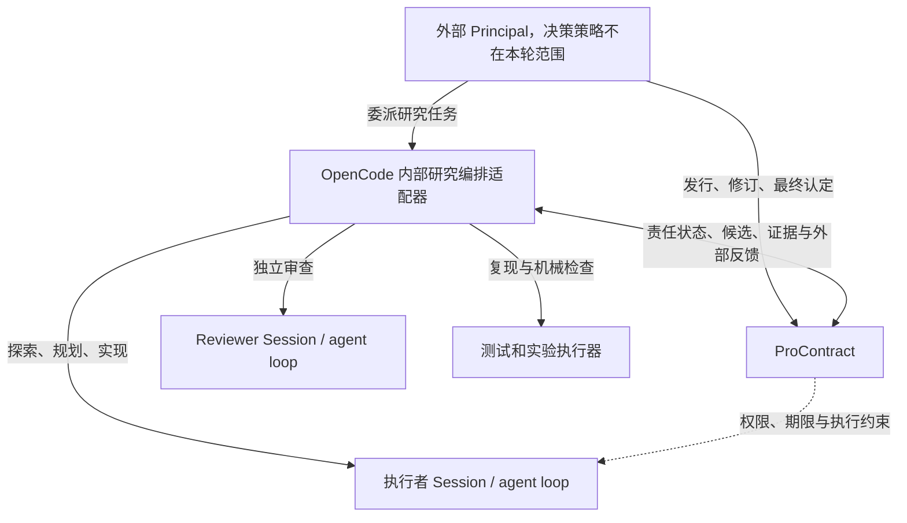

# ProContract 独立 Researcher：研究编排与质量控制方案

2026-09-23 补充：新增显式 `python-script:1` 正式验证适配器，在 Python 进程及其子进程上执行 Linux 隔离，复用原始 deadline、候选与证据身份。通过实际宿主入口进行无真实模型的 CPU PyTorch 联调；不改变 advisory／required 语义，不重评 SBNO 失败试用，不宣称算法或 Researcher 已通过实战。详见[Python 验证修补记录](pro-contract-researcher-python-verification.md)。下文各阶段记录继续按原时点解释。

最新实施状态（2026-09-21）：默认 advisory v3 已实现。Researcher 制定和执行计划，宿主保存材料并请求独立 review；零回应、部分回应、合理不采纳及未写 completion 均可在硬边界满足时继续和明确提交。调用身份由通用工具上下文透传，材料 view 独立校验。见[专项设计](pro-contract-researcher-default-flow.md)、[实施与验收记录](pro-contract-researcher-default-implementation.md)及[独立代码审查](pro-contract-researcher-default-review.md)。新四维测量、归档导出及单例封存已接入专用 `advisory-batch:1` 真实批次入口，使用同一入口完成无模型联调；见[接线实施](pro-contract-researcher-advisory-runner-implementation.md)与[独立审查](pro-contract-researcher-advisory-runner-review.md)。没有新真实模型运行、第八轮、66 例或历史派生评分。

既有 v2 实施与阶段记录：用户于 2026-09-20 确认 reviewer 默认提供独立意见、Researcher 负责回应、运行宿主按任务策略准入。原专项设计见[反馈与策略 v2](pro-contract-researcher-feedback.md)，已通过[独立设计审查](pro-contract-researcher-feedback-design-review.md)。S1–S6 历史设计、审查、冻结配置和结果仍按原版本解释；第三轮失败及误拒见[原记录](pro-contract-researcher-s6c-calibration-v3.md)。宿主实施和验证范围见[实施记录](pro-contract-researcher-feedback-implementation.md)及[独立代码审查](pro-contract-researcher-feedback-code-review.md)；v2 评测运行器另见第 0.1 节与[运行器实施记录](pro-contract-researcher-runner-v2-implementation.md)。随后获准的第四轮三例及独立评分已完成，见第 0.2 节；第四轮后的定向修正与新反馈生命周期见第 0.3 节。第五轮新接线及未完成校准见第 0.4–0.5 节：两个候选双评封存，第三例发行失败，反馈评分未开展。第六轮三例及独立评分／裁决已完成，见第 0.7 节：候选均正确，反馈闭环仍有缺口。66 例资格评测仍未启动。

最新结果见第 0.9 节：第七轮一例候选双评通过，两例未提交，终态封存缺口阻断整批反馈评分；本轮仍为未完成校准。

设计代码基线：`78bec1926`。第 2 节描述此基线；S1 的工作区改动和实际运行验证单列于第 9.5 节，不把历史实验结果或尚未运行的测试视为方案证明。

## 0. 当前新发行默认流程：宿主关联与可选回应（v3）

本节是当前新发行默认协议，优先于历史设计中的普遍强制评审／回应手续；不追溯修改旧任务语义。实际验收与未接线范围以本轮实施记录为准。详细状态转换、源码核查、版本矩阵和验收见[专项设计](pro-contract-researcher-default-flow.md)。[ProContract constitution](pro-contract-constitution.md) 继续约束所有实现。

Researcher 负责原授权内的计划、实施、实验和研究取舍。宿主负责实际授权、身份关联、材料保存、独立 review 检查点、机械准入和候选封存。Reviewer 的发现、科学判断和 P1 严重性标签默认是意见，不自带否决权。Principal 仍在外部负责方向、任务授权与最终认可；本轮不实现其研究决策策略。

宿主从可信 execution 和不可变材料视图绑定 revision、manifestHash、review 身份、计划／候选／证据版本。精确调用重试另外使用工具注入的 assistant message ID 与 tool call ID；不由模型生成，也不按内容相同推断重试。模型提供研究内容和可选择的目标对象，不再手工拼长 hash。单有当前执行身份还不够：旧视图、并发冲突及跨 job／候选／版本引用仍拒绝，不能把旧命令自动绑定到最新材料。拒绝保持物化状态不变并保存记录；普通协议错误提供准确 schema、合法选择器与刷新入口，在原权限／deadline 内可修正，不为常规纠错请求 Principal 决策。

新默认允许合理不采纳、保留分歧或未回应意见后继续和提交。计划检查点结束后自动恢复授权执行；候选检查点后用独立提交／继续研究动作，逐条 response、repair intention、completion 和“确认已读”均不是门票。简要说明鼓励提供，缺失时交付如实标记 `not_provided`／`unaddressed`。普通建议不必进入修复生命周期。方法、数据使用或诊断保留状态改变时，Researcher 仍应维护计划并按新版本验证；旧实验不能支持新候选。

Review 在固定节点由宿主请求，首个切片复用有界串行检查点。格式错误、超时、启动失败等保留真实 unavailable、原始输出及引用解析，不伪造成通过、不自动重审到 accept。核心证据损坏与未确认清理另行阻止依赖操作。权限、任务范围、受保护输入、真实候选／实验／验证、并发身份、原 deadline 和不可变审计仍是硬边界，不能整体删除旧 validator 来放开回应门槛。

交付保留全部原始意见及其原目标、已有简述、可选逐条记录、未决项和缺失标记。宿主保存实际代码／计划变化及实验事实；独立判断确认研究意义上的修复。实际修复成立与 completion 缺失可以同时记录；有 fixed 声明不等于修复成立。可选诊断删除单列，不算实现了正确的选参与评估分离。`ready` 仍只是明确提交的候选，只有规定的外部 exact recognition 支持认可；宿主不得把模型停止或未回应视作自动提交／成功。

兼容采用新的 `reviewPolicy:{version:3,plan:"advisory",delivery:"advisory"}`。首片仅支持该默认组合；v1、所有已发行 v2、显式旧协议及 v2 required／mixed 保持原行为，精确重试不回填。required 继续使用明确的 v2 选择，保留其可用 accept 与原回应手续；未知或矛盾版本拒绝。本轮 S1/S2 已连通新发行默认；不原地迁移历史任务。旧“独立批准才能实验／交付”保证仍限于历史 v1 及明确 required 的相应阶段。

未来评测分别报告研究结果正确性、意见处理质量（含 reviewer 判断）、审计完整性、基础设施状态。新揭盲规则按单例的双评／裁决或可信无候选封存决定，不被其他例的 seal 失败永久阻断；评分上下文严格分离，看过反馈的上下文不得再做未封存候选盲评。本例缺证或评分不可用仍为未评分，总分母保留，不造不存在的候选质量分。第七轮的冻结门槛与原结果不变，任何未来重分析另标派生版本及曝光限制。

最小实施为三片：S1 宿主身份与可恢复协议；S2 advisory 独立动作和完整交付；S3 四维测量与实例隔离。专项设计 A1–A16 覆盖有据不采纳、未回应披露、实际修复与声明分离、协议纠错、过期／越权／漂移／证据损坏、历史 required，以及一例失败不阻断其他例评分。修改主要留在 research 宿主和 research-eval，Core 保持通用权责、事务与执行边界。

六小时每实例墙钟、原 deadline、隔离、取消、单次操作期限和计量要求不变，不新增累计请求、实验或费用上限。原账本、补记和未知项分别报告；实时用量竞态及历史发行卡点未因本设计解决。S3 已通过专用入口接入显式 v3 发行、`advisory-development:1`、rubric、源码／runtime 核验、新建无状态独立评分上下文，以及取消／清理与单例揭盲。确认局部发行失败或单例评分不可用不阻断其他完整实例；更早启动失败仍保守 shared/unknown。新场景让 Researcher 自行提交计划，评分未重跑旧独立 diagnostic interventions，不能直接同比或声称检测能力等价。未来真实批次仍需另行冻结实际模型与评分安排；本轮只运行确定性联调。

## 0.0 已实施的评审策略与职责（v2，保留原义）

本节及[原专项设计](pro-contract-researcher-feedback.md)保留此前 v2 默认与显式 v2 任务的行为；当前新发行默认见第 0 节。下文 S1–S6 的普遍“评审批准才能实验／交付”描述保留为 v1 历史设计，不能用于否决 v2 advisory 任务。旧审查结论不自动覆盖未来 v3 实现；第 0.1–0.9 节及后续里程碑均保留原时点记录。

- Principal 定义任务约定并决定最终认可，本轮不实现其研究决策策略。
- Reviewer 提供独立发现、证据、影响、修复建议与升级记录。Researcher 逐项修复、给出有依据的反驳或保留未决事项。严重性 P1 与校准用例 P1 分开；模型标 P1 或 scope unclear 本身不触发普遍自动暂停。
- 宿主负责执行准入。新任务发行把 `manifest.reviewPolicy={version:2,plan:"advisory",delivery:"advisory"}` 显式写入不可变清单；调用方可逐阶段指定 `required`。策略由 manifestHash/specHash 绑定，不能事后原地改变。已发行且缺省策略的任务及显式 `{version:1}` 保持原流程；精确重试沿用原输入策略。
- v2 把最终评审和 worker 回应放在 Core handoff 之前。反馈阶段只允许读取和控制请求；`review_response` 绑定当前 outcome，必须逐条回应。普通修复返回原授权内的计划／执行阶段，候选变更撤销旧实验与提交资格。
- advisory 的 continue/submit 不要求 reviewer accept，但要求回应完整、权限和原 deadline 有效、计划／候选／正式实验及核心证据身份完整。required 对应阶段继续要求可用 accept。历史 v1 仍承诺“独立评审批准才能实验／交付”；该保证不能再宣称为所有新任务的默认属性。
- `ready` 表示可审阅候选已提交，`accepted` 仍只来自外部 exact attestation。评审意见、准入、提交和认可分别记录；无评审 accept 不等于没有候选，宿主 ready 也不等于研究正确。

Reviewer 出错或格式／引用不可解析时产生独立 `ReviewOutcome`，明确 available/unavailable 和 complete/partial/absent，保留真实 job 状态、原始消息、输出、映射、解析结果与错误。advisory 下仍进入反馈；不能伪造有效评审，不能反复自动重审到 accept。候选／实验／已归档证据损坏仍阻止依赖它们的操作。未知执行必须确认停止并审计，不用不可用状态绕过执行清理。

新报告使用 `{jobID,id}` 选择该 job 不可变映射中的证据，宿主解析为完整 hash。未知、歧义、跨 job、跨候选、跨版本和过期引用均拒绝；旧 63 位错误 hash 不补写。交付包保留所有阶段的原始意见、回应、未决项、严重性与升级说明，包括先前修复轮次。最终提交前再 capture 核对候选，认可时重验全部来源和核心证据。

```text
v2 active: exploration -> plan_review -> feedback -> host plan admission -> execution
                         repair <--------+                       |
execution -> freeze -> mechanical verification -> review -> feedback
   ^----------------------------------------------------- repair |
                         explicit submit + identity/core checks |
                                       Core handoff -> ready -> external exact acceptance
```

评测分列 reviewer 判断、Researcher 反馈处理与最终候选质量。脚本化 provider 测试验证机制，不能当作模型判断能力证明；未盲评的反馈质量明确记为未评分。P1 语义回归比较实际 validation 选参／test 评估与 test 选参／同 test 评估，并保留措辞变体、好坏配对和历史误拒。六小时每实例墙钟、原 deadline、完整计量和单次操作限制不变，无新增累计次数或费用上限。

## 0.1 v2 评测运行器与开发场景

[本次专项设计](pro-contract-researcher-runner-v2.md)在[独立设计审查](pro-contract-researcher-runner-v2-design-review.md)后实施，确定性联调及[独立代码审查](pro-contract-researcher-runner-v2-code-review.md)已完成；运行／评分及验证范围见[实施记录](pro-contract-researcher-runner-v2-implementation.md)。运行配置显式选择 `evaluation:"feedback-v2"`，另冻三例 `feedback-development:1` 公开约定和测量规则；省略该字段仍走旧 v1 探针与评分，v2 不发行 66 例资格批次。

P1 原探针继续测量 reviewer 判断。新 `followup` 只脚本提交一次原好／坏计划并归档身份，随后由实际上游 worker 处理反馈、实现、正式实验、读取和提交。R3 从自主规划开始。运行器在首次 ready 或真实终止／取消／原 deadline 停止，不替 Researcher 决策，不代写修复，不自动认可。首评按最早创建的 job 固定，失败和 partial 不能被后来成功替换；触达依据真实传输记录。

先封存最终候选盲评，再评价首评与逐项反馈。P1 固定真值只绑定匹配的种子计划；R3 自主首计划不套旧标签。无最终候选也保留已发生的首评／反馈评分入口，最终交付仍记不确定。反馈中的真缺陷、无据反对和普通建议分别记录；单项修复不由全局最终正确性代替或抵销。

P1 保留诊断时必须提供实际可执行选择／评估证据；独立隔离干预验证 validation 选参与 held-out test 评估，并改变 ID 和索引排列。可选诊断的删除另记移除或退让，不算实现修复。未出现的反馈机会为 not_observed；确定性 fixture 只验证机制。该运行器实施阶段未启动第四轮真实校准或 66 例评测；随后单独授权的实测见第 0.2 节。每实例原六小时 deadline 和完整计量不变。

## 0.2 第四轮真实开发校准（2026-09-21）

[第四轮记录](pro-contract-researcher-s6c-calibration-v4.md)保留启动前冻结、三例真实执行、双人候选封存和反馈独立评分。使用已审查源码、`feedback-development:1` 与沿用的 `gpt-5.6-luna / low`，没有改运行中源码、配置或评分真值。全部候选封存后才展示评审及回应轨迹，九项分歧已由第三人裁决；评分 agent 为独立上下文、同一模型家族，材料访问限制为合作式。

三个最终候选均双评正确并到达 ready，但反馈处理不能据此计作成功。P1 坏真实完成 validation 选参／test 评估及验证，提前声称 fixed 和计划未同步仍保留；P1 好首评误拒后删除可选诊断，未有据反驳且计划未同步；R3 正确读取证据并报告效应 1 的负结果，但不能把原已存在的命名导出计为修复。四条 finding 完整处理均为 unresolved。两个 P1 最终评审因 hash-as-ID 引用错误记 unavailable，诚实继续；R3 为有效 accept。缺失机会为 not_observed，没有额外重跑制造事件。

63 次真实请求，账本已知 482,301 tokens，完整传输 487,696；一条 interrupted 操作的 5,395 tokens 单列对账，原 unknown 不改写。原六小时 deadline、无累计次数／费用上限及历史材料均保留，没有外部认可或 66 例评测。下一步应处理引用选择器、回应／计划／动作一致性和中断用量对账。新场景改变了策略、后续执行与诊断证据接口，不能用三例正确宣称模型提升或整体研究可靠。

## 0.3 第四轮后的定向修正（2026-09-21）

本轮依据第四轮结果完成[修复生命周期、引用与用量补充设计](pro-contract-researcher-repair-lifecycle.md)，独立审查与实际验证见[实施记录](pro-contract-researcher-repair-lifecycle-implementation.md)及[代码审查记录](pro-contract-researcher-repair-lifecycle-code-review.md)。本轮只使用本地确定性测试和既有归档，没有第五轮真实调用或 66 例评测，也未修改第四轮评分。

新 v2 任务将 `feedbackProtocol:"repair-lifecycle:1"` 固定在 manifest，初始回应使用 `repair_planned/rebutted/unresolved`，另显式声明 `planChange:retain|revise`。方法、数据使用或诊断保留策略改变时，Researcher 在原授权内修订计划，按新版本重新实验和验证。只读反馈阶段可以读取当前归档证据，再追加绑定原 response/finding、当前计划／候选／验证与 durable basis 的 `review_completion`；`fixed/removed/rebutted/unresolved` 是独立判断所需的 Researcher 声明，宿主不把它们认证为研究成功。原声明、修订链、当前适用性和未完成意图均进入交付；未决项不成为 advisory 的普遍否决条件。

旧任务省略 feedbackProtocol 继续按 response:1 解读，精确发行重试不补字段。`feedback-development:1` 运行器显式保持 response:1；未来测量新生命周期须另冻场景，不能静默改旧实验。required 阶段与历史 v1 的 available accept 保证保持。新引用 map 的 promptVersion:2 只提供带材料说明的合法选择器，旧 renderer 和错误原文保留。

用量对账为独立只读派生入口，补充事实绑定原 result、操作及完整传输，不改 Core 状态或原账本。第四轮 R3 的 5,395 tokens 可补证：原已知 482,301，派生已知 487,696；操作仍 interrupted，原 usage unknown。费用、外部评分用量及其余未知项不补成零。机械回归的通过不证明模型已经能可靠处理反馈；第五轮应另行决定，66 例继续暂缓。

## 0.4 修复生命周期评测版本

第五轮另选 `evaluation:"repair-lifecycle-v1"`，冻结 `repair-lifecycle-development:1`、`repair-lifecycle-measurement:1` 与 `repair-lifecycle:1`。第四轮入口、场景和评分保留原样。新版本通过实际宿主联调，把原意图、计划修订、正式实验、完成声明和证据接入独立评分，历史有效性、当前适用性与后续更正分列。实际修复、删除、反驳和未完成意图分别记录；宿主记录声明不代表研究意义上的修复成立。两名评分者对全部三例的候选判断与必要裁决先封存，再展示反馈轨迹；所有展示入口均检查此门槛。详见[专项设计](pro-contract-researcher-runner-lifecycle.md)、[实施记录](pro-contract-researcher-runner-lifecycle-implementation.md)及[独立代码审查](pro-contract-researcher-runner-lifecycle-code-review.md)。

真实运行必须另外冻结沿用的 Luna / low 配置与评分安排；确定性通过仅证明接线。未发生机会保持 not_observed，不制造额外机会，不启动 66 例。原账本、独立补记和未知项分别报告；实时用量竞态仍未消除，派生已知总数不称完整计量。新协议、提示和测量构成场景差异，不能将跨轮差异归因于模型改善。历史 v1 和明确 required 的独立批准门槛不变；advisory 不因未完成意图恢复 reviewer 否决权。

## 0.5 第五轮真实开发校准：未完成批次

[第五轮记录](pro-contract-researcher-s6c-calibration-v5.md)保留新协议接线、94 项测试及独立审查之后的实际冻结与运行。沿用 Luna / low，固定三例分母。P1 坏计划和 R3 均 ready，两名独立评分者分别判其六项候选标准全部正确并封存；P1 好计划在 `research-issue` 准备阶段 IPC 超时，零真实请求、无候选。原失败及 `cleanup.complete=false` 保留，后续未发现残留研究进程；具体卡点尚未确定。

冻结规则要求全部三例候选双评封存后才展示反馈。第三例缺少评分材料，实际 reveal 被拒绝；所有第二阶段判断均 `not_scored`，没有展示轨迹给评分者或补造双人评分。P1 坏最终第六版计划与候选同步删除可选诊断，但没有完成声明；删除不能算实现 validation 选参／test 评估分离。R3 正确报告 signed effect +1 的负结果，原始 review 无 finding；缺少相应反馈机会为 `not_observed`。操作方轨迹观察不代替独立处理评分，不能宣称生命周期可靠。

81 次真实请求，原账本已知 674,632 tokens，来源独立补记 R3 中断操作 6,207，派生已知 680,839；仍有 100 个未知 operation、失败实例缺少操作快照，费用与评分 agent 用量未知。实时竞态未修复，完整计量未建立。六小时原 deadline 与无累计上限不变，没有额外重跑、外部认可或 66 例评测。下一步应定位发行／清理超时，并另冻无候选失败的终态封存规则；新协议、提示和测量差异不支持跨轮模型提升结论。运行后源码与历史完整性核验通过后才更新本段，冻结材料保持原样。

## 0.6 发行证据与无候选封存的显式版本

第五轮后的[专项设计](pro-contract-researcher-infrastructure.md)限定修复发行／清理可观测性及未来无候选终态封存。新增 `infrastructure:{version:1,startup,operation,cleanup}`，仅显式选择时采用 `candidate-or-terminal:1`：全部实际候选双评及必要裁决封存，全部无候选实例封存失败／缺失证据，然后开放反馈。省略字段保留第五轮原三候选门；本轮不重评分第五轮、不启动第六轮或 66 例。

发行阶段 start/exit 与 IPC 等待、进程实际停止分开记录。等待到期关闭连接准入并请求有限清理；迟到结果继续留存，不补记成功。只有 supervisor 回收及宿主身份消失／替换证据共同支持清理确认。未确认时保留 unknown；确认后复制 DB/WAL/SHM，只查副本。原 deadline 不延长，清理期限不因重复调用而重置。

新 terminal 绑定实例、原坐标、runtime、策略、事件链和证据截止清单；已有候选、可信宿主迟到响应或封存后新材料均不能被静默降为缺失。任意模型原始 JSON 不提升为宿主状态证据。无候选保留分母，不伪造质量评分；正常 not_submitted 仍可独立评价已发生反馈，并显式披露无候选 phaseOne。机械封存不认证研究质量或 Principal 认可。

实现与验证见[实施记录](pro-contract-researcher-infrastructure-implementation.md)及[独立审查](pro-contract-researcher-infrastructure-review.md)。确定性流程只证明接线；第五轮具体超时根因及实时用量记录竞态仍未解决。两个正确候选、第三例失败及全批次反馈未评分均保留。旧 v1 和显式 required 阶段继续要求有效评审批准；advisory 未决意见不新增否决。六小时原 deadline、无累计请求／实验／费用上限、隔离和计量要求不变。

## 0.7 第六轮真实开发校准：候选正确，反馈闭环仍未可靠

沿用 Luna / low、三例 repair-lifecycle-development:1，显式冻结三项各 30 秒的 infrastructure 期限和 candidate-or-terminal:1。源码与已审 6,617 项快照相同，24 项预算／网关／接线定向检查通过。三例单次发行和清理均成功；每例保持原六小时 deadline，无累计次数或费用上限，没有补跑。详见[校准记录](pro-contract-researcher-s6c-calibration-v6.md)和[独立评分／审计记录](pro-contract-researcher-s6c-calibration-v6-review.md)。

三例候选各获两名独立评分者六项一致通过，全部封存后才展示轨迹。反馈各 122 项，21 项分歧由第三名独立 agent 裁决；最终 18 项细项 null 保留。P1 坏实际实现 validation 选参／test 评估并先同步计划、正式验证，完成声明缺失不能抹掉实际修复。P1 好最终合法删除诊断，但当前计划仍要求实现它，且没有有据反驳；首评中无据异议与有效实现缺口并存。R3 交付正确负结果，配对措辞澄清不能算原已正确算法的新修复。八项历史意图均仍 pending_intent，三例没有完成声明，反馈处理可靠性未获证明。

九份 reviewer 报告均 available，真实 unavailable／发行超时／无候选封存机会本轮未出现，记为 not_observed，不能宣布第五轮根因已解决。原已知 543,662 tokens、独立补记 47,031、派生已知 590,693 分列；116 个未知操作条目及费用／评分者用量未知，实时计量竞态仍未修复。第五轮未完成校准及所有历史结果保留。

建议先针对历史意图结项、计划同步及具体 finding 回应的提示／状态呈现做定向设计、回归和独立审查，再决定是否另冻小规模第七轮。pending_intent、unresolved 和严重级别 P1 不成为普遍自动否决；历史 v1／显式 required 的强制批准语义不变。三例和变化后的运行器／测量不支持总体可靠性或跨轮模型提升结论，66 例继续暂缓。

## 0.8 第六轮后的收尾呈现与日志去重

本次完成[专项设计](pro-contract-researcher-closure.md)、[独立设计审查](pro-contract-researcher-closure-design-review.md)、[实施与回归](pro-contract-researcher-closure-implementation.md)和[两项独立代码审查](pro-contract-researcher-closure-code-review.md)，没有启动第七轮或 66 例。修改前 6,619 项工作树与第六轮最终快照一致，保全根目录为 `/workspace/researcher-closure-20260921T054035Z`。

`manifest.feedbackGuidance:"closure:1"` 是显式呈现版本，仅用于 v2 repair-lifecycle:1；未选择者保留旧提示。先核对当前计划与实际方法／数据／诊断，变化则先修订计划并重新验证；final-only 对照原任务，不要求计划。交付先检查历史意图和真实证据，追加有据完成／纠正或保留未决，最后提交。完整历史意见、回应摘要、空 responses、原计划和声明当前适用性按 `outcomeHash + findingID` 展示；当前性不是修复认证。advisory 不要求全部 fixed，required 与历史 v1 的 accept 门槛保持。

`infrastructure.journal:"cas:1"` 显式启用可完整恢复的块去重，保留每请求及响应身份、原 payload、错误和迟到状态。恢复延续日志身份／序号，清理按连接保全；旧成功不能授权读取仍运行的新宿主数据库。固定归档日志及其完整对象闭包，损坏或缺失拒绝。写入失败仍有界清理，写后跨绝对期限不交付成功。历史 inline 不改，轮询和 history API 未改。

最终运行器／日志 48 项通过，两包 typecheck 通过；SDK 29 项、完整过程首轮 28 项、修正后独立 4 项及新增空历史 1 项分开记录。确定性样本约节省 90% 存储，只证明该样本；不能解释第五轮超时或证明真实模型可靠。第六轮实际修复、删除不一致及 18 项 null 封存不改；null 多数不适用，不能等同产品缺陷数。第五轮卡点和实时用量竞态仍未解，后续保持原账本／独立补记／未知项分列。下一步另冻小规模第七轮的新呈现／日志配置与独立评分安排，原每实例六小时期限及无累计次数／费用上限不变。

## 0.9 第七轮真实校准：一例候选双评完成，反馈评分受阻

另行冻结同三例、Luna / low、`closure:1`、`cas:1`、原六小时 deadline 及双评／裁决安排后，三例各实际运行一次。详见[第七轮记录](pro-contract-researcher-s6c-calibration-v7.md)和[独立评分／工程复核](pro-contract-researcher-s6c-calibration-v7-review.md)，证据根目录 `/workspace/researcher-calibration-v7-20260921T062428Z`。启动前 28 项定向检查及运行后冻结核验通过；runtime 没有改动。

P1 好提交正确候选，两名评分者各六项全 true；其实际保留 validation 选参／test 评估并追加四条 `fixed` 声明，但这些声明尚未获独立反馈评分。P1 坏修订到第二版计划后在回应新的 finding 集合时失败；R3 两次计划请求少写 manifestHash 一位并停止，两例均未提交候选。正常返回无候选的终态封存错误比较了不存在的顶层 agreement；独立工程复核确认结果形状缺口，未发现已检查坐标漂移。两例 seal 失败使整批反馈保持 `not_scored`，本轮为未完成校准，没有绕过展示门槛或重跑。

真实 CAS 全量 10,361 个事件从归档完整恢复并与 live 一致：恢复表示 4,945,960,542 字节，单份 journal 加块 32,478,860 字节，约减少 99.34%，归档副本另计。这不是总体目录压缩率或时延改善。51 次真实请求；原已知 642,373 tokens，独立补记 9,202，派生已知 651,575；75 个未知条目、费用和评分者用量未知。实时计量竞态与第五轮发行卡点仍未解决。

下一步先修正正常无候选的封存路径并独立回归，定向诊断 worker 的精确身份、逐轮 finding 和版本错误提示，再决定新校准；不追改本轮冻结结果。三例数量、不同提示和实际机会限制比较结论，四次声明调用不等于四次真实修复。历史材料保留，66 例继续暂缓。

## 1. 目标与设计决定

上层 Principal Agent 给出研究方向、范围、权限、期限和交付要求。整个 OpenCode 实例对外表现为一个独立 Researcher，内部能够自主探索、制订计划、实现代码、执行实验、接受独立评审并修复问题。

本项目的产品边界是 **Researcher**。Principal 是外部调用方；本轮不实现其研究方向选择、任务组合、资源分配或最终验收决策策略。OpenCode 接收已授权任务，提交候选与证据，处理外部反馈；内部 reviewer 只有审查权限。ProContract 的 principal 权限及认定接口属于双方共享的协议边界，不等于在 OpenCode 中实现 Principal Agent。

用户确认的计划归属边界（2026-09-19）：Principal 提出任务约定，包括研究方向、目标、范围、硬性约束、权限、期限和交付要求；Researcher 在该约定内自主细化执行计划并维护版本。Principal 也可以明确指定方法、数据集或完整方案，这些指定内容仍是 Researcher 必须遵守的上层约束。S5 版本化的是 Researcher 的执行计划，内部评审与宿主准入只能在原授权范围内生效。

目标是让常见错误能够被发现、阻断和追查，并让中断后的工作正确恢复。研究任务允许产生负结果；“假设未被支持”可以是合格交付，未执行的实验、缺失的证据和无效的比较不能包装成研究成功。

设计决定：

- 在宿主应用层增加研究编排适配器，协调多个已有的 V2 Session 和机械验证任务。
- 执行者与 reviewer 复用 OpenCode agent loop，分别使用独立上下文、工作目录和权限。
- ProContract 保留责任、授权、候选身份、最终认定和 challenge 的职责。
- 研究阶段、计划评审和实验有效性由适配器解释，不新增研究专用的 kernel 状态或命令。
- 通过可信执行边界和认定入口强制检查条件；提示词用于解释工作，不承担唯一的约束责任。

S1–S5 与 S6b 工具实施已完成相应验证；S6c 真实模型评测和 S6d 真实试点继续作为路线图。本轮不启动真实研究实验、不修改冻结 cohort，也不实现 Principal Agent、RSI、通用多 agent 平台或集群调度。

## 2. 当前实现与缺口

| 现有实现                                                                | 可以复用的能力                                            | 本方案不能假定已经存在的能力                     |
| ----------------------------------------------------------------------- | --------------------------------------------------------- | ------------------------------------------------ |
| [Kernel](../packages/core/src/pro-contract/kernel.ts)                   | 精确 revision/spec/subject 检查、职责分离、challenge 传播 | 研究方法审查、证据内容真实性验证                 |
| [Contract store](../packages/core/src/pro-contract.ts)                  | 状态与决策账本事务、外部认定接口                          | 自动 reviewer；外部报告来源认证                  |
| [Execution binding](../packages/core/src/pro-contract/open-code.ts)     | 持久 Session/Prompt 绑定、lease、累计计量                 | 一份研究任务下多个 reviewer 的执行授权和完整计量 |
| [Scheduler](../packages/core/src/pro-contract/scheduler.ts)             | 原生 Contract 的唤醒、恢复、dispatch                      | 计划门槛、reviewer 队列、研究阶段恢复            |
| [Session runner](../packages/core/src/session/runner/llm.ts)            | 单次 provider turn、历史重载、工具结算、期限中止          | 根据研究阶段判断方法是否合格                     |
| [Replay](../packages/core/src/pro-contract/replay.ts)                   | 对冻结快照重跑有限检查并保留观察                          | 自动发现零测试、数据泄漏、不充分覆盖、错误统计   |
| [Contract control tools](../packages/core/src/tool/contract-control.ts) | 请求交付、报告阻塞、申请修订                              | 所有控制调用均经过一致的当前 Session/lease 校验  |

两个现有接口需要明确区分：

1. `principalAttest` 目前只接收 Contract ID 和 `evidenceHash`，由服务读取当前 handoff 补齐候选坐标。它不能表达调用方原先审阅的 exact subject，存在需要修复的读后变更窗口。
2. `issueEvaluation` / `settleEvaluation` 保存外部评估；`settleEvaluation` 要求 delivery 已经 `discharged`。它不是当前交付的前置评审流程，scheduler 也不会自行启动外部 evaluator。

仓库中的历史审计可提供故障场景，但个别描述已经被后续实现改变。实施时以此基线源码和新测试为准，尤其不要沿用已经过时的 deadline、环境转发或 Policy Contract 叙述。

## 3. 分层与权责



| 所属层                     | 负责                                                                   | 不拥有                                          |
| -------------------------- | ---------------------------------------------------------------------- | ----------------------------------------------- |
| 外部 Principal（接口对端） | 研究方向、验收约定、范围修订、最终认定与 release；其决策实现不属于本轮 | 不必参与每次工具调用和普通修复                  |
| 研究编排适配器             | 阶段推进、review job、证据收集、恢复、校验认定材料                     | 不能自行扩大 Principal 授予的权限或改写验收要求 |
| 执行者 Session             | 自主选择探索方法、提交计划、实现、实验、解释结果                       | 不修改评审记录，不认定自己的交付                |
| Reviewer Session           | 审查指定版本，提出可定位的缺陷和验证建议                               | 不修改被评候选，不调用 principal mutation       |
| 机械验证器                 | 执行冻结检查，采集原始观察并输出结构化结果                             | 不从退出码自行推出完整研究结论                  |
| ProContract                | 责任存续、授权、精确身份、认定、challenge、审计账本                    | 不解释研究计划或统计方法                        |
| Agent loop                 | 模型调用、工具执行、事件持久化、上下文与中断                           | 不自行编排研究组织结构                          |

Principal 可以预先授权适配器按既定规则调度、退回和重试；范围变更、验收标准变更、release 和最终认定仍由外部 Principal 发起。第一版不实现自动认定策略，也不让研究协调器或 reviewer 持有 principal 凭据。Reviewer 的通过意见本身不构成 discharge。验收服务可以和 Researcher 共用受信宿主进程，但身份、权限和调用入口必须分开。

外部接口的最小交互是：准入已批准任务、读取进度／交付包、提出准确绑定候选的反馈，以及显式修订、恢复或取消。实现测试使用确定性的调用方模拟这些请求，不需要开发 Principal Agent。

## 4. 一项研究任务的生命周期

### 4.1 发行与有限探索

Principal 批准 Contract 及研究清单。清单明确问题、已知条件、交付物、必要检查、评审规则、允许的探索范围和原始绝对 deadline。清单内容不可原地修改，其 hash 作为明确的验收协议引用写入获批 Spec 的 brief，由 `specHash` 绑定。改变验收清单必须经过 Contract revision，而非仅更新宿主配置。

开始时允许读取资料、检查仓库以及清单事先允许的小型探测。尚未通过计划评审时，只开放这一阶段的工具和资源。昂贵实验的准入由宿主的工具／执行配置判断，不能依赖模型自己给任意 shell 命令贴“便宜”标签。

第一版应使用实际可限制的阶段：计划阶段只读候选目录；允许探测时使用单独 scratch 和宿主配置的执行入口。只有宿主能打开完整实现／实验权限。

### 4.2 计划提交与独立评审

Researcher 的执行者 Session 根据原任务约定提交版本化执行计划，至少包括：任务内的研究子问题和假设、基线、实现路线、实验方法、对照与数据划分、结果解释所用的判定标准、已知不确定性。计划须明确对应原任务要求；内部实验判据不能替换或降低 Principal 已约定的验收标准。Principal 已给出详细方案时，执行计划承接该方案，仅细化被授权自行决定的部分。

Reviewer 获得原始委派、约束、计划和必要背景，在独立 Session 中判断：

- 计划是否遵守原任务约定，包括 Principal 明确指定的方法、数据集与验收要求。
- 实验是否能够回答提出的问题；比较是否混入其他因素。
- 基线、对照、指标和失败条件是否完整。
- 是否存在明显数据泄漏、错误统计、不可复现依赖或不可行的资源假设。
- 哪些缺陷必须先修复，哪些属于可以带着披露继续探索的不确定性。

输出 `accept`、`changes_requested` 或 `unavailable`。每条阻断意见需要定位到计划内容、约束或证据，并说明如何解除。格式无效、缺少必要输入、执行中断均不得记为通过。

通过意见绑定 exact `planHash`、原 Contract revision／`specHash` 和研究清单版本。范围内的研究子问题、评测协议、数据划分或关键方法改变时，Researcher 更新计划并重新审查，由宿主按既定规则重新准入；默认无需 Principal 逐次批准这些范围内调整。第一版保守地使相关评审失效，不用未经验证的语义 diff 自动继承批准。对实际方法与计划不符的检测，区分下节可机械识别的输入变更和需要独立判断的方法偏离。

改变外部委派的研究目标、硬性约束、验收要求、权限或期限，以及替换 Principal 指定的方法或数据集，必须通过 ProContract 提出修订请求，由外部 Principal 决定。在修订获批前，不得执行需要新授权的实验；内部 reviewer 的 `accept` 不能代替这一外部决定。原任务 revision 改变后，旧计划评审不得直接沿用。无法确认调整仍在授权范围内时，保留未决项并停止相关实验准入，不能由执行者或 reviewer 自行推定授权。

### 4.3 实现、实验与中途检查

计划通过后，执行者在已批准范围内自主推进。默认先复现基线和最小 smoke test，再开展主要实验。

宿主验证器记录命令、代码版本、配置、数据标识、实际执行的测试、失败与跳过数量、原始输出和退出状态。预期应有测试而实际为零、进程成功但结构化结果含失败、结果文件来源不明时，不能生成通过证据。

这些判据由每种任务的验证适配器定义；通用文本搜索无法可靠解释所有测试框架。不能解析的结果保留 `unavailable` 或未知事实，并由既定规则处理，不能默认成功。

普通测试失败在当前 active 执行中修复，不创建新 Contract，也不自动消费新的语义 attempt。方法变更的门槛分为两类：

- **可机械检查的输入。** 清单指定受保护的评测脚本、数据划分、实验配置和其他必须预先批准的输入。正式实验经宿主入口运行；入口为本次 job materialize 冻结输入，核对获批 hash 和执行协议，并在运行期间保护这些输入。不能只检查 live 文件后再让 shell 任意修改它。输入变化时关闭正式实验准入，并区分变更属于原任务约定还是 Researcher 执行计划：前者等待外部修订批准，后者在原授权内重新评审和准入。
- **需要判断的方法偏离。** 关键算法是否偏离计划、对照是否仍然充分，由执行者申报和独立 reviewer 判断。不能自动识别的偏离属于待测的漏检风险，不声称 `planHash` 未变即可保证方法合规。

对提供实验前硬门槛的 profile，正式实验必须使用受控的运行入口；任意 shell 不能同时取得修改受保护输入和执行已认可正式实验的能力。如果合作式 profile 仍开放任意 shell，绕过入口产生的结果标为未准入、不能支持验收，并明确不宣称已阻止其计算消耗。第一版不开发通用命令语义判定器。

### 4.4 冻结交付与最终评审

执行者请求 `contract_report_ready`。研究模式先校验当前计划批准与必要执行记录，持久化这项请求，并关闭新的修改型工具准入；工具返回“交付请求已收到”，不得在工具内部等待自己的 drain 结束。协调器在工具返回后，等待已准入写操作完成或中止并确认其子进程清理，再捕获 subject、运行 replay、进行当前授权检查并提交 handoff，进入 `verification`。无法确认写入已经停止时保持阻塞，不宣称已经冻结。

这个短暂的 `freezing` 阶段属于研究适配器。现有同步 ready 工具不能原样承担这条研究路径；需要通过对应 driver 提交请求，由宿主在 drain 外完成。并发写工具、延迟工具结果、capture/replay 期间的取消均须纳入验证。新的主工作区写入被阻止后，研究许可仍不能突破原始 deadline。

此后执行者不能继续修改这个候选；实际评审始终读取 retained subject，不读取可能变化的 live workspace。Reviewer 和机械验证器在独立目录复现关键检查，并核对每条结论与原始证据的对应关系。

若构建或测试需要写文件，允许写入从冻结 subject 创建的一次性验证工作树；冻结 subject 和研究者工作目录仍不可写。清理前保存协议要求的验证产物、变化和捕获完整性，明确区分被审源码与验证生成的文件。当前 replay 会清理临时目录，证据留存需要明确新增接线。

验收材料完整且通过后提交外部 Principal。Researcher 的可用里程碑止于可验收交付包及外部反馈后的修复。发现候选缺陷时，提交精确 subject-bound 缺陷报告／challenge 请求，由外部有权主体提交 challenge；第一版不为内部 reviewer 或协调器隐含授予该权限。验证基础设施不可用时保留等待／阻塞，不能伪造成候选失败或通过。

```text
Contract active:
  exploration -> plan_review -> execution
                    ^              |
                    +-- method change

contract_report_ready -> Contract verification:
  frozen candidate -> mechanical verification + independent review
    pass        -> publish reviewable bundle -> wait for external decision
    defect      -> publish defect report -> external challenge -> remediation
    unavailable -> waiting / owner-visible blockage

External Principal / shared ProContract boundary:
  exact attestation -> discharged
  exact challenge  -> dormant -> active remediation
```

最终负结果只要执行方法合格、证据完整且报告准确，也可以获得认定。`released`、期限耗尽或研究中断需要单独呈现，不能统计为成功研究交付。

## 5. 独立性与信任边界

独立 reviewer 至少满足以下条件：

- 使用另一份 Session，上下文从原始任务和待审材料重新构造，不复制执行者的整段推理作为评审依据。
- 可以读取原始日志、代码、计划和失败记录，不能只看到执行者挑选的成功摘要。
- 获得只读候选和独立 scratch；进程工具不能因此取得主工作目录、账本或凭据写权限。
- 评审身份、模型配置、输入材料和输出来源由宿主记录，执行者不能自报一个 `passed` 字段代替 reviewer。
- 同一模型的不同 Session 提供职责分离，不足以证明错误统计独立。不同模型或方法可用于更强审查，但仍需实际评测遗漏率。

可信协调器、研究状态库与证据归档处于 worker 可写空间之外。Principal 凭据由外部调用方或分离的可信认定入口持有，不注入研究协调器、执行者或 reviewer。共享 ProContract 边界对研究模式的所有认定入口执行相同的证据准入，包括 HTTP、CLI 和嵌入式路径；不能只保护新增 UI。

第一版可以先验证合作式本地部署的控制逻辑。若 worker 仍能经 shell 访问宿主数据库、凭据或评审存储，只能报告该威胁模型下的结果。宣称不可绕过前，必须完成进程、文件、网络和凭据隔离的真实边界测试。

Principal 若确实需要放宽验收要求，必须显式批准新的清单／条款版本并留下记录；不能静默跳过审查后继续标为完整评审通过。

## 6. 持久状态与精确身份

研究适配器持有自己的私有状态和事件记录，不把阶段字段加入 `ProContract.Info.status`。最小逻辑对象如下；实现时可用少量表和内容寻址文件，不要求每个对象建立独立服务。

| 对象                | 最少记录                                                                                                                           |
| ------------------- | ---------------------------------------------------------------------------------------------------------------------------------- |
| 研究清单及批准记录  | 不可变的问题与交付要求、评审／验证协议、受保护输入、原始 deadline 和清单 hash；独立批准记录绑定 root Contract ID/revision/specHash |
| 研究状态            | 当前清单、阶段、当前 planHash、候选 subject、暂停／取消标记、协调器 generation、评审有效性版本、关联 job                           |
| Job                 | 类型、精确输入 hash、Session/Prompt 或进程标识、输入准入状态、owner/generation、deadline、执行与计量记录                           |
| 评审／验证报告      | job 与输入身份、reviewer／验证器身份、候选／计划／协议版本、意见、原始证据引用、捕获完整性                                         |
| 验收上下文与 bundle | 当前 handoff 的唯一轮次、清单 hash、planHash、评审有效性版本；适用报告、结论对应证据、未决事项及 bundle hash                       |

原则：

- 哈希证明内容身份；来源可信性来自宿主实际启动的 job 和受保护的记录链。
- 计划修改使旧计划批准失效；候选改变使依赖该候选的代码／结果评审失效。旧记录保留。
- `requires` 继续只表示真实的支持依赖，不用来表达阶段顺序或 reviewer 的调用关系。
- 文献、数据、环境和外部服务不一定被 Git tree 覆盖。研究清单与验证报告必须记录实际依赖；无法冻结的部分明确披露。
- 研究清单是批准的验收约定，不恢复已经删除的 `Spec.policy`、`Requirement.policy` 或全局 `contract_policy`。

清单正文不包含生成后的 `specHash`，避免“Spec 包含清单 hash、清单又包含 Spec hash”的循环；二者通过单独的批准记录关联。

协调器 generation 只用于执行所有权 fencing。评审有效性版本用于使批准失效；每次新 handoff 的唯一身份用于区分同一个 subject 的不同交付轮次。这三个身份不能互相替代。challenge 撤销当前验收上下文；重新提交相同源码也必须得到新的 handoff 身份。

S1 的 `Binding.generation` 是每次执行 claim 的身份，随 claim 增加，区别于未来研究协调器的 generation。历史 binding 缺少该字段时按 0 解释，下次 claim 增至 1；缺少可信工具调用身份仍拒绝，不能用兼容默认值给旧调用补发授权。

## 7. 与现有调度和 agent loop 的具体接线

### 7.1 每份 binding 只有一个调度责任方

不能在当前 scheduler 旁边直接加一个也调用 `claim`／`prompt` 的循环。两者会在计划评审、恢复和 heartbeat 上争夺同一执行。

提议在 OpenCode execution binding 增加宿主设置的调度器标识，例如 `driver`，默认兼容原生调度。它属于执行适配器元数据，不进入 Contract Spec 或 kernel 状态。

- driver 的责任覆盖 activation、claim、heartbeat、drain outcome、blocked/retry 和恢复；原生 driver 只处理自己拥有的 binding。共同的期限检查继续生效，但不得由另一个 driver 续租或重排工作。
- 研究协调器拥有研究 binding 的阶段准入与上述执行处置，并复用已有 Session admission 和 drain 机制。
- 研究 driver 未注册、清单缺失或无法恢复时，binding 不回退为普通执行。
- 发行研究任务时必须使 duty、binding 的 driver 和初始关闭的阶段准入一致可见。可采用明确的事务入口；不能先发行可运行的普通 Contract，再异步贴上研究标签。
- 协调器调度权与 Session drain 所有权分开；不新建包裹 provider turns 的 durable drain 身份。

`driver` 的迁移、原生默认值和原子发行是接线前置工作，当前 API 尚不提供完整能力。

尤其需要改动 `session/execution/local.ts`：目前正常 drain 结束会直接 `reschedule(new)`，终止 provider 错误会直接 escalate。改为向该 binding 的 driver 交付带当前 Session、Prompt、owner 和 generation 的通用结束结果。研究 driver 根据已持久化的阶段意图区分正常等待和真实失败；过期的结束回调不得改变新 owner 的状态。

计划提交后，先停止新执行、确认当前 drain 和工具结束，再释放执行 lease 并记录等待阶段，保留相同语义 attempt。复审后由研究 driver 准入新的 prompt 并重新 claim，不能把正常暂停传给原生 `reschedule(new)`。`contract_report_blocked` 的重试决定也交给对应 driver；不得把“计划已完成、等待 reviewer”伪装成 blocked work。所有这些等待与阶段切换都不重置累计用量或期限。

### 7.2 阶段准入需要实际执行边界

研究适配器计算当前 Session 允许使用的能力和 deadline，Core 在 provider admission、工具执行及控制工具入口执行通用的授权／失效检查。Core 只消费有限的执行许可，不解释 `plan_review` 等研究词汇。

执行者许可必须与既有权限、active Contract lease、revision 和 deadline 取交集，不能覆盖或扩大它们。Reviewer 使用下一节的独立验证 job 许可，不要求持有 inactive root 的执行者 lease。进入等待评审、暂停或取消时撤销相关执行许可并中止已有工作；重新检查待执行调用，防止旧 provider response 在阶段变化后继续产生效果。

不得在 `ToolRegistry` 增设第二套工具表示或授权回调。沿用 leaf 拥有权限与副作用顺序的架构：通用许可服务由 provider admission 和各实际执行入口读取，在可能等待的权限答复之后再次校验；控制工具、组合工具的子动作和验证进程也覆盖。工具目录过滤仅决定可见性，不视为执行授权。这一边界必须先通过真实绕过测试，才能打开研究 profile。

保持以下 Session 约束：

- `SessionExecution` 仍是 process-global、Session-ID based；Location-scoped 的 runner、工具和上下文服务不变。
- `SessionV2.prompt` 先持久准入，后 advisory wake；精确重试复用相同 prompt ID 和 delivery。
- 一次 provider turn 保留一次显式 `llm.stream(request)`，不在 tool 内嵌套另一个 agent loop。
- 阶段切换使用安全边界、显式中断及新的工作准入，不能仅追加一条 steer 后假定旧工具已经停止。

### 7.3 Reviewer job 不冒充主执行 binding

当前 binding 一份 Contract 只关联一个当前执行 Session。不能把 reviewer 轮流写进这个字段，也不能借用已失效的执行者 lease。

研究适配器单独持久化 reviewer job，调用原生 Session API 执行；在启动前绑定宿主拥有的只读权限、原始 deadline、取消标记和计量归属。Session 需要持久的受控 job 身份；重启后 job、driver 或许可未装载时拒绝 prompt/resume，不回退为普通无绑定 Session。未完成这种接线的普通 Session，不允许用于声称有约束的研究评审。

特别是 root Contract 在 `verification` 时，主执行者不允许继续执行；reviewer 的许可来自单独的宿主验证 job，只允许检查冻结候选。它不通过伪装 root 为 `active` 获取执行权。

### 7.4 认定入口绑定调用者预期的候选

本节单列为 **共享 ProContract 边界修复**。它保障外部 Principal 调用的精确性，不实现谁应当通过、何时接受负结果等研究决策策略。Researcher 产出所需的身份和证据，外部调用方提交有权认定。

扩展认定输入，要求调用者提供预期 `revision`、`specHash`、`subjectHash`、当前 handoff 的唯一身份、验收上下文 hash 和认定操作 ID。仅前三个坐标不足：同一个 subject 被 challenge 后重新交付，旧请求仍可能匹配前三者。

每次 handoff 由可信存储赋予不可复用的身份，可由新的 ID 或准确的 accepted handoff 事件身份表示；不依赖毫秒时间或 subjectHash 代替轮次。历史 handoff 的迁移必须能从唯一历史事件建立映射，无法唯一确定时拒绝推测。它是通用交付身份，不是研究专用状态。

研究 profile 先校验不可变报告字节和宿主 job 来源。随后在**同一权威提交事务**内比较当前 root 坐标、handoff 身份、不可变验收上下文、评审有效性版本和当前准入状态，再执行 discharge 并记录操作 receipt；不能把宿主校验与普通 discharge 作为存在空隙的两次提交。

因此参与认定 CAS 的最小 profile／上下文引用与操作 receipt 必须位于 Contract store 同一事务域。大型报告和研究编排细节仍由宿主管理；Core 只比较不透明身份和版本，不解释研究方法。需要一个可组合的存储事务入口，不能假设当前 `principalAttest` 已支持这一能力。清单变更提升 root revision；相关批准撤销提升评审有效性版本；challenge 和新 handoff 改变交付轮次并撤销旧上下文。

相同认定操作 ID 的重试只返回该操作已保存的历史 receipt，并单独给出当前支持是否仍有效；不同内容复用同一 ID 必须冲突。若其后发生 challenge，重试旧操作不能再次 discharge。现有每次生成新 attestation ID 的行为需要调整。

评审要求不能只靠一个可选的前端检查。实施必须列出所有可达 principal mutation 路径，并保证研究任务的认定通过同一宿主校验；直接 Core service 仍是可信内部能力，不能暴露给 worker。

持久的 research profile 标记使未装载研究校验器的 Server／CLI 拒绝该任务的认定。缺少适配器不能回退到只接受 `evidenceHash` 的普通入口。通用接口与事务投影在 Core，宿主提供研究校验实现；Server 和 Core 不反向 import `sdk-next`。

控制工具需要独立检查当前 Session/owner/lease/revision。免除某些控制操作的 action 计数，不等于免除执行授权；`report_ready` 的 replay 完成后也需要检查提交权限是否仍然有效。

## 8. 恢复、中止与预算

### 8.1 恢复协议

先持久化 job 身份和精确输入，再准入 Session prompt。协调器重启时从 job、Session inbox、原始事件和报告恢复，不凭“Session 存在”推断工作已开始或已结束。

| 中断位置                         | 恢复要求                                                                                                   |
| -------------------------------- | ---------------------------------------------------------------------------------------------------------- |
| job 已建、prompt 未准入          | 使用相同 job/Session/Prompt 身份完成准入                                                                   |
| prompt 已准入、wake 未发生       | 重发 advisory wake，不重复用户消息                                                                         |
| prompt 已 promoted、完成状态未知 | 核对 provider／工具事件；显式决定同一工作继续还是建立保留 lineage 的新尝试，不能只重发 wake 就认定已经恢复 |
| provider／工具执行中断           | 保留已知用量与 unknown；先判断副作用，不能盲目重放修改操作                                                 |
| 报告写入后、阶段未推进           | 验证已有报告并幂等推进，不再启动相同成功 job                                                               |
| 认定提交后、响应丢失             | 核对当前 exact attestation 和操作身份，返回同一结果或明确冲突                                              |
| 协调器 lease 被接管              | 旧 generation 不能推进阶段、提交评审或发布当前验收上下文；外部认定仍须比较当前上下文                       |

这是研究 job 的显式恢复协议，不授权通用 Session 在进程重启后自动重试所有 provider 工作。第一版使用单宿主、串行阶段调度；执行者和同一候选的最终 reviewer 不同时写共享目录。

幂等记录不保证任意 shell 副作用 exactly-once。修改型操作结果未知时，先核对实际产物或升级给 owner；reviewer 只读检查可以按记录的恢复规则重新执行，并保留每次尝试与成本。

### 8.2 取消与失败处置

用户中止研究时先持久化取消标记，再中止关联 Session 和子进程。重新启动协调器不得自动恢复已取消工作。取消不等于 discharge；责任保持可见，由外部 Principal 后续 resume、revision 或 release。取消使此前尚未提交的认定上下文失效；Principal 后续可以显式检查已有材料并通过可信入口建立新的有效上下文、发起新的认定操作，不能让旧请求继续提交。取消与认定提交在同一当前准入检查上排序；新上下文不授予额外计算时间。

Reviewer 崩溃、报告缺失、网络不可用和无法解析属于验证不可用；候选检查明确失败才属于缺陷。Reviewer 的结论相互矛盾时保留分歧并交给 Principal，不能不断更换 reviewer 直到得到通过意见。

### 8.3 全部工作共享原始期限与完整会计

执行、评审、复现、摘要和恢复使用同一研究任务的原始绝对 deadline；创建新 Session、进入 verification 或更换 reviewer 均不重新计时。该期限传播至 provider admission、自动 compaction、工具结算、验证进程和后台工作，不能只在外面加一个存活期间的 timer。Reviewer 也不得意外继承 generic agent steps 的累计上限。

到期后停止新的研究计算并中止在途工作；允许有界的进程清理和持久化已产生的记录，不借清理继续实验。保留已完成材料供后续认定；认定已存在证据不授予额外计算时间。语义 attempt 仍遵循 Principal 已批准的 resolution，正常阶段等待不能消耗它。

未来 ProgramBench profile 遵循当前用户约定：每实例六小时墙钟上限，不增加累计 provider-turn、tool-action、请求次数或金额上限，不用大有限数模拟无限。研究任务的一般期限由 Principal 明确指定。

记录执行者、所有 reviewer、验证器、重试与失败的完整用量；缺失 usage 标为未知。保留单次操作超时、显式取消和有具体故障依据的基础设施熔断，不用固定 review 次数暗中替代墙钟预算。

第一版研究 profile 只接受 deadline-only 配置。带显式累计次数上限的历史 Contract 继续使用原生执行；在研究 profile 尚不能原子共享所有角色的计数前明确拒绝该组合，不能让 reviewer 使用未计入限额的普通 Session。后续支持需单独验证。

## 9. 实施计划

### 9.1 范围与代码归属

宿主适配器先放在允许组合 Client、Core、Server 的宿主包中，候选位置为 `packages/sdk-next/src/research/`；CLI 仅提供入口。状态、调度和报告校验保持相邻，不提前拆出通用研究平台。具体导出在实施时审查，Core 不反向依赖宿主包。

| 改动位置                                                                    | 最小职责                                                                                      |
| --------------------------------------------------------------------------- | --------------------------------------------------------------------------------------------- |
| 宿主 research 模块                                                          | 清单、持久研究状态、job、阶段推进、报告校验                                                   |
| `core/pro-contract/open-code.ts`、scheduler 与 `session/execution/local.ts` | binding 全生命周期调度归属、原子准入、阶段等待的 lease 处理、旧结束回调 fencing；原生行为兼容 |
| Session／工具执行边界                                                       | 绑定宿主执行许可、deadline、取消与计量；不解释研究阶段                                        |
| `core/tool/contract-control.ts`                                             | 当前执行授权检查；研究模式的交付准入                                                          |
| 共享 Contract store 与 Protocol／Server／CLI／SDK                           | 唯一 handoff、验收上下文 CAS、幂等认定操作及统一可信入口；不实现 Principal 决策策略           |
| 宿主验证适配器                                                              | 测试结果解析、数据／配置／环境身份、复现任务                                                  |

`sdk-next` 当前使用固定的 Server 服务图；实施需要在宿主构造时向该图注入同一组 driver、执行许可和验收服务。它们的接口由下层声明、实现由宿主提供，且参与同一个 memo map／资源作用域，不能在旁边创建另一个互不知情的 OpenCode runtime。验收 CAS 的小型存储投影服从上述同一事务域要求。

### 9.2 切片、依赖与接受条件

下表按实施顺序排列。每个切片允许若干聚焦 PR，但只有整项接受条件满足后才记为完成。研究模式在 S4 前保持不可发行；S1、S2 的通用修复可以独立使用。未完成的切片不通过默认值降级为普通 Session 或普通认定。

| 切片                          | 依赖与最小改动范围                                                                                                           | 接受条件与完成后可声明的能力                                                                                                                                                                                          |
| ----------------------------- | ---------------------------------------------------------------------------------------------------------------------------- | --------------------------------------------------------------------------------------------------------------------------------------------------------------------------------------------------------------------- |
| **S1：当前执行的控制授权**    | 无研究模块依赖。provider admission、可信工具上下文、控制工具、OpenCode binding、必要的 Contract store 事务入口及真实边界测试 | 原 provider turn 的身份不可被刷新；旧 Session、旧 prompt／owner／claim generation、失效 lease、过期 revision 不能提交执行控制效果。外部批准按 exact petition 完成；拒绝保留审计及已发生用量。只声明工具控制边界修复。 |
| **S2：共享精确认定边界**      | 接续 S1。Contract store、通用身份、Protocol／Server／CLI／SDK 与迁移                                                         | 同 subject 再交付有不同 handoff；验收上下文比较和 receipt 同事务；历史重试不重新认定。所有入口一致，历史身份无法唯一恢复时明确拒绝。测试调用方代表外部 Principal。                                                    |
| **S3a：driver 完整生命周期**  | 接续 S1、S2。binding、scheduler、`session/execution/local.ts`，宿主注入接口                                                  | 原子发行、activation、heartbeat、结束回调、blocked/retry、接管与恢复均服从同一 driver；`maxAttempts: 1` 下多轮正常等待不增加 attempt；旧回调无效。生产研究 driver 仍不开放。                                          |
| **S3b：受控 job 与执行许可**  | S3a。宿主 job／状态、Session 持久身份、provider 与 leaf 执行边界                                                             | 未安装 driver／许可时 prompt/resume 拒绝；权限等待后重查；reviewer 有独立授权且复用原始 deadline、取消及完整计量。验证 compaction、组合工具、验证进程和重启路径。先用确定性测试执行器。                               |
| **S4：Researcher 可验收交付** | S2、S3a、S3b 全部完成。`sdk-next` research 模块、冻结屏障、验证适配器、独立 reviewer、证据归档                               | 执行、冻结、机械检查、独立评审、交付包发布真实贯通；准确处理外部 challenge 并修复后重新交付。过期报告、零测试、原始证据缺失不能通过。合作式部署须标明隔离限制。此时只开放最终评审 profile。                           |
| **S5：计划及方法门槛**        | S4。版本化计划、阶段许可、受保护输入、受控实验入口                                                                           | 计划未批准时不能启动被认可的正式实验；计划／受保护输入变更使批准失效；同一 shell 先改后跑的结果无法冒充已准入证据。完整研究 profile 到此才开放。                                                                      |
| **S6：质量资格验证**          | S5。已知缺陷任务、正负结果任务与观测报告                                                                                     | 先验证故障恢复与已知缺陷，再在另行确定的真实任务上测量漏检、误阻断、有效交付、时长与完整用量；不把一次通过当作可靠性证明。                                                                                            |

S4 的最小流程是：接收外部已批准任务 → 执行 → 冻结候选 → 检查与独立 review → 发布可验收交付包 → 等待外部决定；外部 challenge 后执行修复分支。测试调用方可发送明确的接受、拒绝、取消或修订请求，不实现自主研究管理。S4 尚无计划门槛，不作为完整研究 profile 启动长期研究任务。

S5 的设计、实现及接受测试必须保留上述计划归属边界：

- Researcher 能在同一任务约定内提交和修改执行计划；必要的内部复审不要求 Principal 为每个执行细节重新发行任务。
- 即使内部 reviewer 返回 `accept`，改变任务目标、固定方法／数据、验收标准、权限或期限的计划也不能获得超出原授权的执行准入。
- 外部修订决定绑定原申请和任务身份；未批准、拒绝或结果未知时均不能按新条款执行，旧计划批准也不能用于新 revision。
- 范围内的计划更新和复审保留原 deadline 与累计用量，不开发 Principal 的研究方向选择、任务分配或最终验收策略。

### 9.3 第一个实现切片：S1

目的：让当前 binding 的执行授权覆盖全部 Contract 控制效果。核心反例是旧 Session 经 `forSession` 找到退休映射后仍使用当前 revision 提交，或当前调用在 replay／权限等待期间被接管，随后继续提交成功、失败或修订结果。

- 先梳理 `contract_check`、`contract_report_ready`、`contract_report_blocked`、`contract_propose_revision` 的成功、失败和超时路径，以及 `contract_propose` 的已有批准入口。provider admission 捕获 Session、prompt、owner、revision 及每次 claim 不复用的 generation，并沿可信 Tool.Context 传至 leaf；字段不进入模型输入 schema。工具开始时不能重读 binding 并冒充原 turn 身份；同 Session 的延迟 provider response 和组合工具子动作保留原身份。缺失身份失败关闭，历史 binding 的 generation 使用明确兼容规则。
- 工具开始时拒绝无效调用；耗时操作前后重新检查。产生 Contract 状态变更时，在同一存储事务内核对原执行身份和当前授权，再提交效果与审计，避免“先检查、后写入”窗口。超时／replay unavailable 的 escalation 与 blocked 的重排也不能绕过这一检查。只读授权可在事务外预检，capture、replay 和 permission 等待不得放入写事务。状态命令被拒绝时先提交拒绝 receipt，再在事务外转为 ToolFailure；工具准入阶段的拒绝由持久工具事件记录，不伪造尚未发生的 kernel 命令。
- 修订申请及批准等待分成两种权限：申请须持有有效执行身份；已经获外部 permission 的完成操作只可处理原 accepted petition 的唯一事件身份、原 revision 和 specHash，不依赖等待期间过期的执行 lease。pending 会停止 heartbeat，故等待超过 30 秒仍可完成原申请。相同条款被拒绝后重提也有不同申请身份，旧批准不能生效。只授予处理这一申请的有限权限，不恢复普通执行授权。
- 明确拒绝（含没有附加说明的 reject）完成原申请的拒绝；中断、调用方消失或重启导致批准未知时保留 pending，并向外部呈现待处置状态，不能自动通过、重发已批准的决定或永久声称后台仍在等待。外部可显式完成／拒绝该申请。第一切片保留已有用户批准机制，不开发 Principal 策略。
- 不在工具 registry 新增授权回调，不把研究阶段放进 kernel。优先在现有 binding／store 边界表达检查；若涉及 reducer，应按 Constitution 说明无法仅在边缘保障的原因。
- 不增加控制动作计数，不把查询授权伪装成 `reserveAction`。本切片不声称解决任意 shell 的进程隔离、冻结写入屏障或整个 driver 生命周期；这些分别由 S3／S4 验收。

S1 必须有真实存储、provider-to-tool 与工具调用的回归：当前有效调用成功；退休 Session 拒绝；同 Session 再 claim 后旧 turn／旧 prompt 拒绝；缺失执行身份拒绝；lease 失效及不同 owner 拒绝；replay 完成前接管后拒绝；replay 失败／超时不能影响新执行；超过 lease 时长的原申请批准可完成；同条款重提后旧批准无效；没有说明的 reject 清理原 pending；中断后保留可见 pending。拒绝不额外消费 action 或修改职责／候选；已经合法准入的 replay 消耗、失败记录与产物继续保留，不能回滚或退款。测试应控制中断位置，不依赖任意 sleep 或仅测试检查 helper。

S1 的旧调用保证只覆盖上述工具控制路径。`session/execution/local.ts` 的旧 drain 结束回调及调度接管归属在 S3a 完成；S1 不以工具修复宣称整个执行生命周期已经 fenced。

### 9.4 实施验证与独立审查

先使用真实 store、Session admission 和工具边界，配合可控制输出／中断位置的测试 provider 与脚本 reviewer，验证调度和认定。实际 LLM reviewer 的缺陷识别质量在 S6 单独测量，不能与流程测试混为一谈。

每个切片的变更说明记录 invariant、反例、改动及兼容性、测试证据和剩余限制。独立代码审查重点检查绕过路径、检查后状态改变、恢复和权限遗漏；处理影响本切片保证的问题后才宣称完成。后续切片可以调整内部实现，但不得隐式扩大本轮范围。

公共身份／API 变化与调用方迁移在同一切片交付；数据库迁移有历史数据夹具，遇到缺失身份失败关闭。中间版本缺少依赖时明确拒绝研究任务，不以关闭 reviewer 或跳过证据检查维持表面可运行。

修改公共 Protocol／Server HttpApi 后运行 `packages/client` 的 `bun run generate`；更新 legacy SDK 使用仓库生成脚本，不手改生成目录。测试和 `bun typecheck` 从对应 package 目录运行。

遵守 [ProContract Constitution](pro-contract-constitution.md)：新增研究语义留在边缘。若通用边界修复涉及 Core，应逐项说明维护的 invariant、反例、为何不能由边缘独自保证，以及纯 kernel 和真实边界测试；本方案不预设必须扩展 reducer。

### 9.5 S1 实施记录（2026-09-18）

已完成本切片的实现和针对性验证。S2–S6 尚未实施，研究 profile 尚未开放。新增的编排设计没有转化为 Principal Agent 实现。

- **执行身份。** runner 在 provider 准入时捕获 Session、prompt、revision、owner 和 claim generation，通过原有工具上下文传递；组合工具子动作保留相同身份。控制 leaf 不从当前 binding 重新生成旧调用的授权。普通动作计量入口也核对该身份，时间在事务内重新读取。
- **原子控制提交。** OpenCode binding 提供预检和受限的内部 command guard，Contract store 在写事务内执行 guard，再提交状态或拒绝 receipt 及账本。耗时快照、replay 和 permission 等待均在事务外；拒绝转成 ToolFailure 时 receipt 已提交。ready 的成功、不可用及 blocked 重排路径都使用原身份。
- **修订完成。** 工具保存 accepted petition 的账本序号、revision 和预期 specHash；permission 回复只可完成该申请。等待超过 lease、无说明拒绝、同条款重提后旧 approve／reject、等待中断和持久 pending 跨数据库重开均有验证。普通外部 `decideRevision` 的兼容调用尚未变成强制 exact 接口，这部分不冒充 S2 已完成。
- **计量与兼容。** 授权检查不额外计费，合法启动的 replay 在最终提交被拒时仍保留消耗。ready 无 replay、blocked、revision 保持原有控制调用计数豁免；check 及带 replay 的 ready 保留各自一次 action 准入。普通未绑定 Session 的 proposal 仍走既有外部批准入口。未修改公共 Protocol／HttpApi 或生成目录。

Core change gate：本切片维护 Constitution 的 effect authority、exact identity 和 auditable rejection。仅在 leaf 预检不能防止等待或事务排队期间发生接管；必须在权威写事务内比较原调用身份，并在同一账本记录拒绝。新增概念为执行 claim generation、可信调用上下文、事务内 adapter guard 及 exact petition 完成条件；替换原控制工具直接提交与 revision ID-only 回调路径。纯 kernel 的状态与命令没有改变，现有 kernel／Constitution 测试继续通过；真实 store、Session、工具和进程边界另行测试。

验证环境使用仓库指定的 Bun `1.3.14`，按现有 lockfile 安装依赖，未修改依赖声明或 lockfile。从 `packages/core` 执行：

| 验证                                                                                                                                                            | 结果                                                                                                                |
| --------------------------------------------------------------------------------------------------------------------------------------------------------------- | ------------------------------------------------------------------------------------------------------------------- |
| 改动前 `pro-contract.test.ts`、`location-layer.test.ts` 基线                                                                                                    | 61 项通过                                                                                                           |
| `pro-contract-control.test.ts`、`pro-contract.test.ts`、`location-layer.test.ts`、`session-runner-tool-registry.test.ts`、`tool-action-fusion.test.ts`          | 113 项通过；其后仅扩展 S1 专项用例并单独复验                                                                        |
| `session-runner.test.ts`、`pro-contract-constitution.test.ts`、`pro-contract-export.test.ts`、`pro-contract-observation.test.ts`、`pro-contract-replay.test.ts` | 131 项通过，含真实 runner 到控制 leaf 的延迟响应拒绝                                                                |
| 最终 `pro-contract-control.test.ts`                                                                                                                             | 18 项通过，包含原申请之前追加 rejected petition、数据库重开及真实 replay 进程的成功、失败、不可用和超时四类接管结果 |
| `bun typecheck`                                                                                                                                                 | 通过                                                                                                                |

独立代码审查发现准入计量使用调用前的时间，事务排队跨过 lease 时可能多扣一次用量；已在事务内重新取时，并增加 captured-time 过期回归。最终审查结论单独记录于 [S1 代码审查报告](pro-contract-researcher-s1-review.md)。

上表为 Core 集成测试：runner 的模型流是脚本化 `LLMEvent`，数据库重开也不是进程崩溃。用户随后批准补充生产服务器子进程、真实 HTTP 模型适配器、磁盘数据库、租约自然过期及 `SIGKILL` 重启验证；其拓扑、九项场景和执行结果另记于 [S1 应用 E2E 报告](pro-contract-researcher-s1-e2e.md)。

范围限制保持明确：未实现整个 driver 生命周期的旧 drain fencing、研究计划门槛、reviewer job 或强进程隔离；这些属于后续切片。现有同步 ready 也尚未获得研究模式的写入冻结屏障。本轮验证不构成真实研究质量的资格证明。

### 9.5 S2 实施结果

S2 已完成共享精确认定边界、上下文版本、持久幂等回执、evaluation 原子结算，以及 Protocol／Server／CLI／TUI／两代 SDK 调用迁移。独立设计与代码评审均通过；最终 Core 相关测试 260 项、S1 进程 E2E 9 项、S2 进程 E2E 5 项通过。详细结果、兼容性与性能限制见 [S2 实施与验证记录](pro-contract-researcher-s2-implementation.md)。S2 的验收边界是共享精确认定；后续 driver 生命周期的实施结果见下一节。

### 9.6 S3a 实施结果（2026-09-18）

S3a 已完成通用执行 driver 的完整生命周期：原子发行、版本化准入、activation／claim／heartbeat／outcome／blocked／恢复统一归属同一 driver；正常等待保留语义 attempt、累计用量和原始 deadline。旧回调按原执行身份拒绝，driver 缺失或故障不回退原生执行。宿主注入已贯通 sdk-next、Server、scheduler 和 Location runner。

独立设计审查三项问题和代码审查七项问题均已修正并复核。进程回归发现的 replay 取消证据留存问题也已补齐：不完整输出不算通过，归档失败保留 scratch，取消后仍不能越权 handoff。最终 Core 相关测试 290 项、SDK 6 项、HTTP 相关 53 项、生产进程 E2E 17 项全部通过；Core／Server／sdk-next／opencode 类型检查通过。

详细实现、可复现命令、测试证据与限制见 [S3a 实施与验证记录](pro-contract-researcher-s3a-implementation.md)，独立结论及源文件指纹见 [S3a 代码审查](pro-contract-researcher-s3a-code-review.md)。后续 S3b 的受控 job 与执行许可结果见下一节。生产研究 driver 尚未开放；研究计划门槛、完整冻结／检查／独立评审流水线和真实研究实验均不属于 S3a 已完成内容。

### 9.7 S3b 实施结果（2026-09-19）

S3b 已实现独立 reviewer／verifier job 及实际执行许可。reviewer 使用独立持久 Session 和原有 agent loop，只能在固定 Location 内通过授权的只读工具检查材料；verifier 执行冻结的机械验证输入。宿主发行的身份贯通 provider、compaction、canonical Tool、权限等待及文件／进程执行边界，原许可失效后不能借用恢复出的新许可继续运行。

主 worker 与 job 双向互斥，取消后的清理屏障覆盖真实操作及其 finalizer；远端宿主不能替原 owner 提前退租。恢复仅允许从未开始操作的 job 显式续行，且保留原 deadline；已开始操作的崩溃任务不能自动重放。原始 usage、部分验证证据及 unknown 状态均有持久记录；已开始工具被中断后留下 error 终态。既有修订审批继续按原申请精确处理，没有引入 Principal Agent 策略。

独立代码审查提出了缺失身份降级、提前退租、清理屏障遗漏、reference 授权回归、崩溃会计、旧许可重捕获及工具终态缺失七项问题，均已修复并复核，最终审查通过。最终 Core 相关测试 629 项、SDK 8 项、HTTP 53 项、S1–S3b 真实进程测试 28 项通过，六个包的类型检查与迁移检查通过。详细范围、测试记录与兼容性见 [S3b 实施与验证记录](pro-contract-researcher-s3b-implementation.md)，独立结论及 57 个源文件指纹见 [S3b 代码审查](pro-contract-researcher-s3b-code-review.md)。

当前 job 仅支持 deadline-only root，隔离仍为合作式；`completed` 表示执行结束，不等于评审通过或研究结论可靠。下一切片 S4 才贯通候选冻结、机械检查、独立评审、证据包与交付／challenge；S5 才加入计划与方法门槛。生产研究 profile 仍未开放，本轮未运行真实研究任务。

### 9.8 S4 实施结果（2026-09-19）

S4 的实现、恢复协议、证据与适用限制见 [实施验收](pro-contract-researcher-s4-implementation.md)，发现及复核见 [独立代码审查](pro-contract-researcher-s4-code-review.md)。以冻结的 [S4 设计](pro-contract-researcher-s4.md)为实施依据，不改写此前切片的历史验收结果。

可选 `research-final:1` 宿主贯通专属工作区执行、ready 清理屏障、snapshot 冻结、固定 Node 测试、独立只读 reviewer、不可变证据包及外部 exact 认定。机械缺陷在同 attempt 修复；reviewer 缺陷等待外部 challenge。取消与准入同事务撤销，未知执行不自动重放，显式恢复保留期限和历史 lineage。

只开放最终交付评审 profile；S5 计划与方法门槛、S6 科学质量资格验证仍未实施。S4 的流程测试不证明实际 reviewer 的缺陷识别质量，本轮没有运行真实研究任务。

### 9.9 S5 实施结果（2026-09-19）

S5 按冻结的 [详细设计](pro-contract-researcher-s5.md)实现可选 `research:1`，通过 `research.issue({ planning: true, ... })` 启用；省略该选项保持 S4。Principal 定义任务约定和明确指定的约束，Researcher 在其范围内版本化执行计划；内部 reviewer 与宿主均不能扩大外部权限、验收要求或原始期限。

流程已贯通只读探索、输入哈希观测、独立计划评审、获批实现、受控正式实验、冻结交付、最终审查与精确认可。计划或保护输入变化后不能复用旧批准；修订申请即刻撤销旧执行上下文，被拒绝后仍须重新规划。原生任务随后重新准入会换新 Session，同时保留原 attempt、用量和 deadline。未知工作不自动重放，恢复保留原始记录。

S5 12 项生产端到端测试通过，最终计划 reviewer 恢复用例另行补验；Core 146 项、SDK 24 项、HTTP 53 项通过，既有 S1–S4 进程场景均有通过证据。实现范围、前次失败与修复、最终源码冻结和逐项验证见 [S5 实施记录](pro-contract-researcher-s5-implementation.md)，独立发现及签署见 [S5 代码审查](pro-contract-researcher-s5-code-review.md)。此前各节保留对应切片验收时的范围。

当前正式实验仅支持固定的 Node TAP 适配器，仍为合作式隔离。流程测试不证明真实 reviewer 的漏检率或研究方法有效性；S6 科学质量资格验证、其他研究计算适配器与真实研究实验尚未实施。

### 9.10 S6 评测设计（2026-09-19）

用户批准先编写 [S6 评测设计](pro-contract-researcher-s6.md)并进行独立审查。本阶段将已知好／坏材料的真实 reviewer 探针与真实 Researcher 完整任务分开计量，以独立 oracle 和盲评验证缺陷识别、误阻断、有效交付、修复、恢复及完整用量。正确负结果和有证据的不确定结果均可完成任务，内部 reviewer 的接受不能充当评测真值。

本轮只完成设计、审查与修订；任务语料、评测工具、确切模型配置及真实运行仍需后续实施与冻结。Principal 提供任务约定，Researcher 在约定内版本化执行计划的边界不变，不新增 Principal 策略。独立审查结果见 [S6 设计审查](pro-contract-researcher-s6-review.md)，设计通过不表示 S6 质量验证已经完成。

### 9.11 S6b 实施结果（2026-09-19）

按已批准顺序实现独立评分／账本、最小生产校准、完整语料／隔离／故障观察，并完成独立 agent 审查、修复及复核。新增评测层复用生产 research、canonical 工具、独立 reviewer job、Node TAP 和 exact 认可；原始 verdict 与实际 gate 分开计分，缺失实例及失败保留分母。

完整冻结自检 66/66，771 assertions，821.35 秒，包含 48 探针和 18 完整任务。19 项工具单测、74 项 Core／driver、2 项 Schema 及 14 项 S5/S4 生产回归通过；七包类型检查通过。独立发现 F1–F8 均已关闭，原反例、失败批次、计量派生校正及取证副作用留档。生产必要修复仅使 `Resolution.maxAttempts` 可省略，保留历史有限配置语义并重新生成客户端，满足原六小时 deadline-only 预算。

详细源码 hash、日志与边界见 [S6b 实施记录](pro-contract-researcher-s6b-implementation.md)和[独立代码审查](pro-contract-researcher-s6b-code-review.md)，后续入口见[执行交接](pro-contract-researcher-handoff.md)。本轮响应全部来自本地确定性 HTTP fixture，`qualification` 仍为 `not_run`；不推断真实模型的缺陷识别率或研究质量，不启动 S6c。评测部署的 Linux 隔离不改变生产 research 的合作式隔离定位。

### 9.12 S6c 运行准备（2026-09-19）

用户批准推进下一步，已形成 [S6c 准备清单](pro-contract-researcher-s6c.md)和[机器可读草稿](pro-contract-researcher-s6c-preparation.json)，保存完整准备快照、开发校准与资格实例顺序，并完成 19 项评测工具、2 项 Core 预算、2 项 Schema 检查。S6b 的 31 项被审源码保持不变；已有英文方案和所有未提交改动保留。

当前环境没有已配置的模型连接，worker／reviewer、provider 部署、真实启动器／代理接线及盲评分工尚未确定。准备草稿明确为 `launchable: false`，未填值被冻结 schema 拒绝；没有真实模型请求、Contract 发行或资格结果。后续先完成这些输入和接线，再做独立开发校准及最终冻结，不将 S6b 确定性入口或历史环境配置当作已就绪的 S6c 运行器。

### 9.13 S6c 离线运行接线（2026-09-20）

按用户继续推进的授权，新增独立启动／冻结入口、固定 HTTPS provider 代理、隔离的生产 research 宿主、原 deadline 内的故障恢复、候选与 reviewer 两阶段盲评、exact 认可及完整资格派生报告。P/F 只有 worker 准备可脚本化，R 的 worker 和所有 reviewer 的真实运行路径均要求模型；本轮验证全部使用明确标记的本地 fixture。

接线工具套件 38/38 通过；认可收尾修订另跑 R3 完整路径，S6b 默认生产回归 5/5、包类型检查通过。独立审查复现并推动修复孤儿进程清理、冻结清单完整性、成功落盘与清理顺序、故障恢复同步及运行／评分版本身份等问题，W1–W9 全部关闭并已签署通过；最终适用范围、测试日志及签署见[实施记录](pro-contract-researcher-s6c-wiring.md)和[独立审查](pro-contract-researcher-s6c-wiring-review.md)。已有生产改动、英文方案和全部历史记录保留，本轮没有改公共 API。

实际 worker／reviewer 模型、部署与凭据引用、独立评分者仍待指定。尚未调用外部模型、运行三个开发校准或发行 66 实例资格 cohort；工具验证不代表研究质量通过。后续沿用先开发校准、再最终冻结和资格评测的顺序，每实例仍只有原六小时累计墙钟预算。

## 10. 验证与接受标准

第一组检查使用真实 Session admission、store、工具边界和脚本化 provider／reviewer，不调用付费模型，不依赖隐藏评测。

| 场景                                          | 必须观察到的行为                                                    |
| --------------------------------------------- | ------------------------------------------------------------------- |
| 计划未批准却请求正式实验                      | 真实执行入口拒绝，产生可追踪原因                                    |
| 执行者自报 review passed                      | 无宿主 job 来源的报告不能开门或认定                                 |
| `maxAttempts: 1` 下正常提交计划并多轮复审     | 保留同一语义 attempt，不被原生 drain 回调 escalate                  |
| 原生和研究 driver 同时运行                    | activation、heartbeat、retry 和旧 drain 回调均服从调度归属          |
| 命令退出零但未运行预期测试                    | 结构化校验阻断，不能报告测试通过                                    |
| 测试失败被 shell pipeline 吞掉退出码          | 验证器根据真实测试结果拒绝通过                                      |
| 读取旧版本结果文件                            | 输入／候选／job 身份不匹配，拒绝引用                                |
| 计划变更后复用旧批准                          | 相关批准失效，必要阶段重新审查                                      |
| 不改计划文本，修改受保护配置后运行            | 受控入口拒绝或明确标为未准入，不能成为正式实验的验收证据            |
| 同一命令先改配置再运行                        | 冻结输入及运行权限阻止绕过；合作式任意 shell profile 不冒充事前阻断 |
| Reviewer 通过 A 后候选变成 B                  | A 的报告不能支持 B 的认定                                           |
| A 被 challenge 后，同 revision 再次 handoff A | 新轮次不能接收旧认定，即使源码 hash 相同                            |
| bundle 校验后、认定提交前清单或批准被更新     | 事务内的当前上下文比较拒绝旧意见                                    |
| 认定成功后被 challenge，再重试原认定操作      | 只返回历史 receipt 和当前失效状态，不重新 discharge                 |
| Reviewer 读不到原始证据或输出非法报告         | 记为 unavailable，责任仍未完成                                      |
| Reviewer 可运行测试                           | 只能修改验证 scratch，不能修改 subject／主工作区／评审库            |
| Reviewer Session 存在而 job／driver 未装载    | prompt/resume 拒绝，不回退普通 Session                              |
| 写工具与 ready 并发                           | 停止并确认写入后才 capture；无自等待死锁，无混合快照                |
| dispatch、报告提交、认定响应处发生中断        | 正确恢复或显式冲突，不凭缺失结果推进                                |
| 接管后旧 Session 发控制调用                   | 当前授权检查拒绝，不消耗新 attempt 或改变候选                       |
| 中止后重启服务                                | 不再启动执行或 review；责任与取消原因可见                           |
| 报告已写入但认定未提交时取消                  | 旧认定上下文失效，保留材料供外部 Principal 显式处置                 |
| 原始 deadline 在 review 期间到达              | 中止在途计算；无新期限、无虚构报告                                  |
| Reviewer compaction 或工具结算跨越 deadline   | 同一原始期限生效，保留已知计量与 unknown                            |
| 超过旧累计次数边界                            | deadline-only 任务仍合法继续，计量与恢复保留完整计数                |
| 研究假设被正确否证                            | 可以提交准确负结果并完成研究责任                                    |
| 普通非研究 Contract                           | 生命周期、权限、预算和调度兼容                                      |

后续真实任务同时报告：低级错误漏检率、错误认定、有效候选误阻断、限时有效交付、恢复后证据保留、总时长与完整用量。研究结论是否正确与基础设施是否顺利运行分别计量。

初次授权覆盖范围修订、实施计划独立审查、问题处理和 S1。用户随后批准 S1 生产 E2E、S2、S3a、S3b 完整实施，各切片结果见相应记录。2026-09-19 用户批准继续 S4，具体范围见 [S4 设计](pro-contract-researcher-s4.md)。用户随后明确批准继续 S5，并确认 Principal／Researcher 的计划归属边界。S5 的设计、独立审查、实施和验证已完成，具体范围见 [S5 设计](pro-contract-researcher-s5.md)及[实施记录](pro-contract-researcher-s5-implementation.md)。用户接着批准 S6 评测设计文档、独立审查与修订，见 [S6 设计](pro-contract-researcher-s6.md)。用户随后批准按交接顺序完成 S6b 实施、测试和独立审查，本轮已完成，见第 9.11 节。用户随后批准推进 S6c 准备工作，当前状态见第 9.12 节。S6c 真实模型运行、真实研究试点和对外发布未启动。

## 11. 独立审查重点

请审查者结合基线源码，重点寻找反例：

1. 研究语义是否渗入 kernel 或通用 agent loop，是否有更小的接线方式。
2. driver、阶段许可和现有 binding／lease 是否存在双重调度或默认放行窗口。
3. Reviewer 在 verification 阶段的权限、期限和计量是否可实现，是否偷换为无限制普通 Session。
4. 计划批准、候选、验证报告和认定是否具备完整的失效与并发检查。
5. 取消、重启、未知副作用和认定响应丢失是否有明确处置。
6. 独立性和强制性是否只是文字承诺，是否遗漏可达的绕过入口。
7. 最小切片是否仍然过大，是否有缺失的真实验证案例。

审查结论应区分已确认的设计缺陷、待实现验证的风险和可选改进。文档被审查不等于实现通过验收。

本次专项审查重点是 Researcher 范围、共享边界归属、切片依赖、中间版本安全性及 S1 的实际可实现性。原架构审查有效的结论继续保留；修订后必须记录新的被审版本，不把历史“无阻断项”套用于未经审查的变化。

## 12. 初评修订记录

独立 agent 的初评结论为“需修订后实施”，包含两项 P1 和一项 P2。修订保持原报告，供复核：

- **F1：调度生命周期不完整。** 第 7.1 节补齐 drain outcome、blocked/retry、heartbeat、正常等待的 lease 处置及旧回调 fencing；实施范围加入 `session/execution/local.ts`。
- **F2：过期认定与同 subject 再交付。** 第 6、7.4 节区分协调器 generation、评审有效性版本和 handoff 轮次，要求不可变验收上下文、同事务 CAS 与幂等认定 receipt；验收清单变化必须经过 root revision。
- **F3：方法变化无法仅由计划文本检测。** 第 4.3 节明确受保护输入与受控实验入口，并收窄对未申报语义偏离的保证。

同时补充冻结前的写入屏障、Reviewer 的独立许可与失败关闭、compaction 的期限传播、报告清理前留存、已 promoted 工作恢复和宿主服务图注入。相应反例加入第 10 节。以上是设计修订，均有待实现验证。
